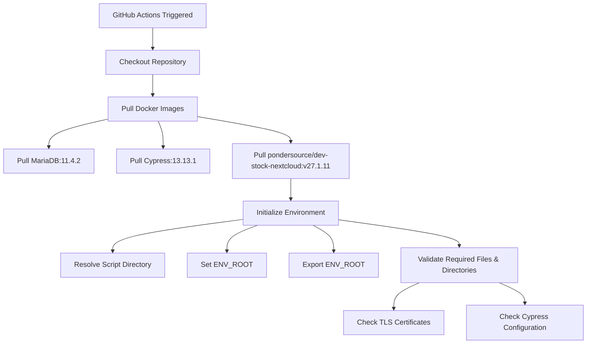
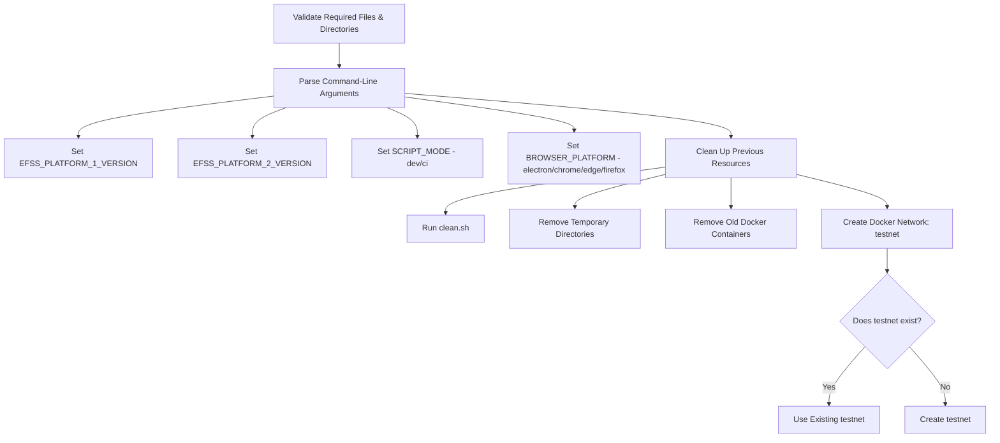
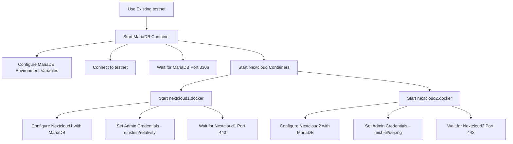
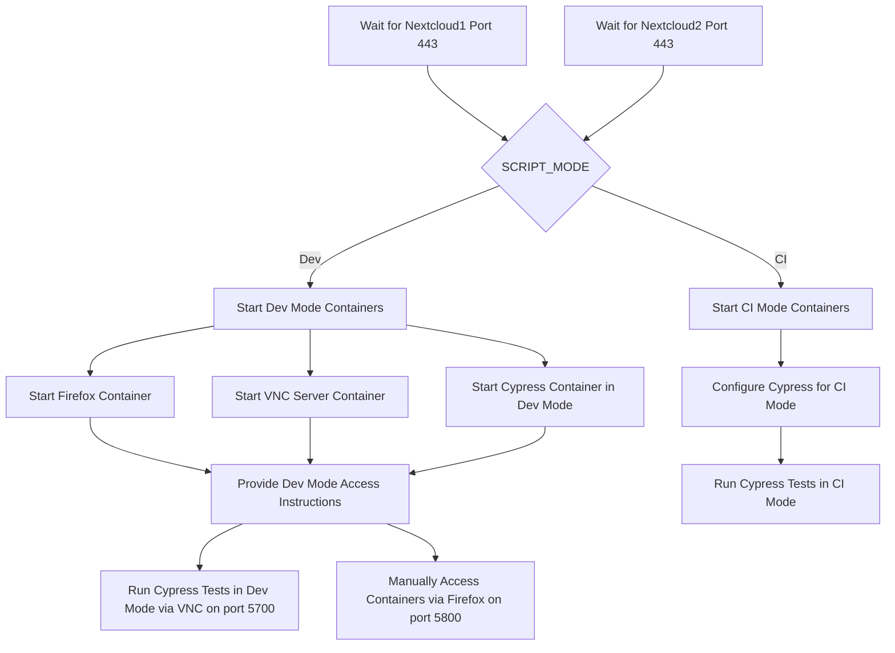
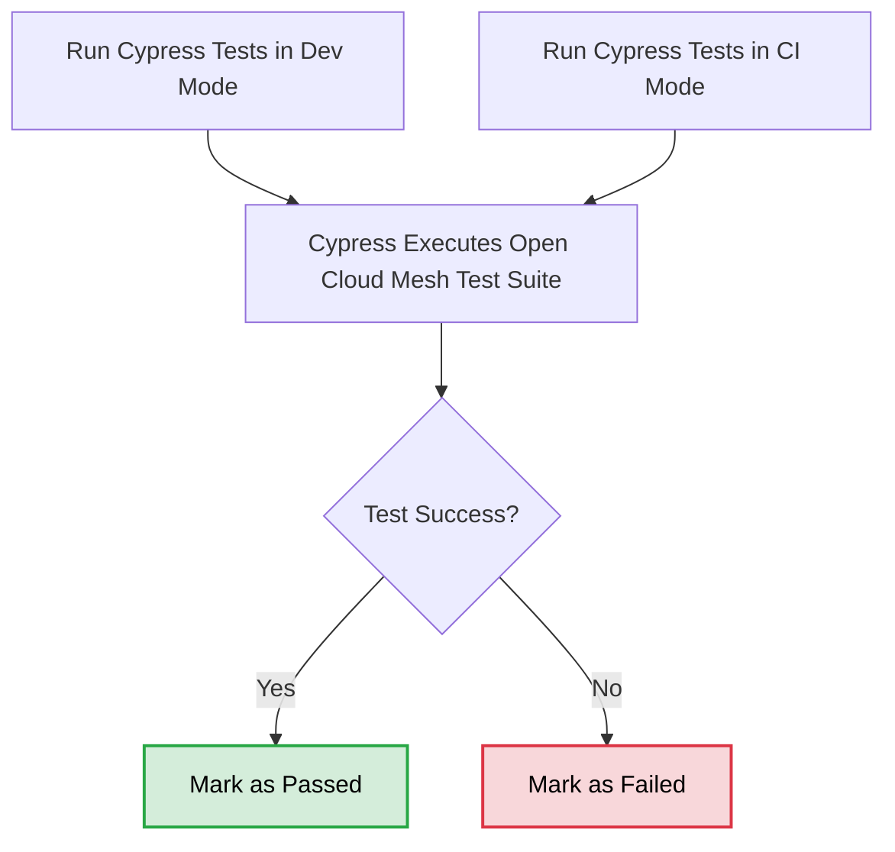
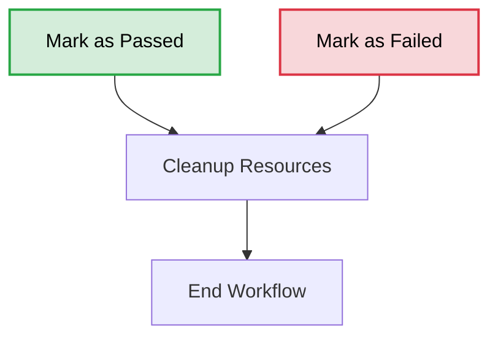

# Development Stockpile 🛠️📦  
A collection of Docker images and scripts designed to set up a complete development environment for building and testing applications. 🚀

---

## Table of Contents 📑

1. [Our Dockerized EFSS Images](#our-dockerized-efss-images-)
   - [Nextcloud Versions](#nextcloud-versions)
   - [ownCloud Versions](#owncloud-versions)
   - [Docker Pull Commands](#docker-pull-commands)
2. [Our Dockerized Reva Images](#our-dockerized-reva-images-)
   - [Reva Versions](#reva-versions)
   - [Docker Pull Commands](#docker-pull-commands-1)
3. [Open Cloud Mesh Test Suite](#open-cloud-mesh-test-suite-)
   - [What is the Open Cloud Mesh Test Suite?](#what-is-the-open-cloud-mesh-test-suite-)
   - [Why Open Cloud Mesh?](#why-open-cloud-mesh-)
   - [Features of the OCM Test Suite](#features-of-the-ocm-test-suite-)
   - [Key Test Categories](#key-test-categories-)
   - [Supported Platforms](#supported-platforms-)
   - [How It Works](#how-it-works-)
   - [Benefits of the Open Cloud Mesh Test Suite](#benefits-of-the-open-cloud-mesh-test-suite-)
   - [Learn More](#learn-more-)
4. [OCM Compatibility Results](#ocm-compatibility-results-)
   - [Legend](#legend-)
   - [Login Tests](#login-tests-)
   - [Share Link Tests](#share-link-tests-)
   - [Share With Tests](#share-with-tests-)
   - [Invite Link Tests](#invite-link-tests-)
5. [Developer's Guide for the Open Cloud Mesh Test Suite](#developers-guide-for-the-open-cloud-mesh-test-suite-)
   - [Command Syntax](#command-syntax-️)
   - [Example Usage](#example-usage-)
   - [Notes](#notes-)
6. [Debugging](#debugging)
   - [RD-SRAM](#rd-sram)
   - [ScienceMesh](#sciencemesh)
   - [Trashbin](#trashbin)
7. [Using XDebug](#using-xdebug)
8. [SOLID RemoteStorage](#solid-remotestorage)

---

## Our Dockerized EFSS Images 📂
**EFSS (Enterprise File Sync and Share)** solutions are software platforms designed to enable organizations to securely share and synchronize files, both internally and externally.
These systems are built to ensure data integrity, compliance, and accessibility, making them essential for modern collaboration. 
Some popular EFSS platforms include **Nextcloud** and **ownCloud**, which provide robust, open-source solutions for enterprise file management.

### Nextcloud Versions

| **Repository**                   | **Tag**         | **Branch**                                                                | **Upstream**                                                                 |
|----------------------------------|-----------------|---------------------------------------------------------------------------|------------------------------------------------------------------------------|
| pondersource/dev-stock-nextcloud | latest, v30.0.2 | [v30.0.2](https://github.com/nextcloud/server/releases/tag/v30.0.2)       | [Official Nextcloud Server](https://github.com/nextcloud/server)             |
| pondersource/dev-stock-nextcloud | v29.0.10         | [v29.0.10](https://github.com/nextcloud/server/releases/tag/v29.0.10)       | [Official Nextcloud Server](https://github.com/nextcloud/server)             |
| pondersource/dev-stock-nextcloud | v28.0.14        | [v28.0.14](https://github.com/nextcloud/server/releases/tag/v28.0.14)     | [Official Nextcloud Server](https://github.com/nextcloud/server)             |
| pondersource/dev-stock-nextcloud | v27.1.11        | [v27.1.11](https://github.com/nextcloud/server/releases/tag/v27.1.11)     | [Official Nextcloud Server](https://github.com/nextcloud/server)             |

---

### ownCloud Versions

| **Repository**                   | **Tag**       | **Branch**                                                                 | **Upstream**                                                                 |
|----------------------------------|---------------|----------------------------------------------------------------------------|------------------------------------------------------------------------------|
| pondersource/dev-stock-owncloud  | v10.15.0      | [v10.15.0](https://github.com/owncloud/core/releases/tag/v10.15.0)         | [Official ownCloud Core](https://github.com/owncloud/core)                   |


#### Docker Pull Commands
To pull the Docker images for EFSS, use the following commands:

```bash
# Pull the latest version of Nextcloud
docker pull pondersource/dev-stock-nextcloud:latest

# Pull a specific version of Nextcloud
docker pull pondersource/dev-stock-nextcloud:v30.0.2
docker pull pondersource/dev-stock-nextcloud:v29.0.10

# Pull a specific version of ownCloud
docker pull pondersource/dev-stock-owncloud:v10.15.0
```

## Our Dockerized Reva Images 🚀
[**Reva**](https://github.com/cs3org/reva) is a key component in the **CS3API** ecosystem, designed to provide a robust backend for cloud storage and file-sharing services. It acts as a middleware for connecting EFSS platforms, enabling smooth communication and interoperability.

---

### Reva Versions

| **Repository**               | **Tag**       | **Branch**                                                                | **Upstream**                                                                |
|------------------------------|---------------|---------------------------------------------------------------------------|-----------------------------------------------------------------------------|
| pondersource/dev-stock-reva  | v1.28.0       | [v1.28.0](https://github.com/cs3org/reva/releases/tag/v1.28.0)            | [Official Reva Repository](https://github.com/cs3org/reva)                  |

---

#### Docker Pull Commands
To pull the Docker image for Reva, use the following command:

```bash
# Pull the specific version of Reva
docker pull pondersource/dev-stock-reva:v1.28.0
```

# Open Cloud Mesh Test Suite 🌐🧪

## What is the Open Cloud Mesh Test Suite? 🤔

The **Open Cloud Mesh (OCM) Test Suite** is a comprehensive collection of automated tests designed to validate interoperability between different **Enterprise File Sync and Share (EFSS)** platforms that implement the **Open Cloud Mesh** standard. The Open Cloud Mesh API specification is an open source, community-driven project. The project is hosted as a [W3C Community Group](https://www.w3.org/community/ocm/).

---

## Why Open Cloud Mesh? 🤝

**Open Cloud Mesh (OCM)** aims to bridge the gap between different EFSS systems, allowing organizations to collaborate efficiently, regardless of the platform they use. By implementing OCM:
- **Interoperability**: Files can be shared across platforms like **Nextcloud**, **ownCloud**, **Seafile**, and others.
- **Vendor Independence**: Organizations are not locked into a single EFSS solution.
- **Enhanced Collaboration**: Facilitates file sharing between users and organizations in a secure, standard-compliant way.

---

## Features of the OCM Test Suite 🚀

1. **Cross-Platform Validation**:
   - Ensures compatibility between popular EFSS platforms like **Nextcloud**, **ownCloud**, **Seafile**, and **oCIS**.
   
2. **Comprehensive Coverage**:
   - Includes tests for **file sharing**, **link sharing**, **user invitations**.

3. **Version-Aware Testing**:
   - Validates platform behavior across multiple versions, ensuring backward compatibility.

4. **Automated CI Integration**:
   - Runs tests on a **Continuous Integration (CI)** pipeline for every new EFSS version release.

---

## Key Test Categories 📝

1. **Login Tests**:
   - Simple authentication for different EFSS platforms.

2. **Share Link Tests**:
   - Tests the ability to share files and directories via public links across platforms and the ability to add
   a public link share to your own EFSS.

3. **Share With Tests**:
   - Validates sharing files directly with specific users on other EFSS platforms.

4. **Invite Link Tests**:
   - Checks the invitation workflows, enabling users to invite external collaborators seamlessly.

---

## Supported Platforms 📋

The test suite currently supports:
- **Nextcloud** (v27, v28, v29, v30)
- **ownCloud** (v10.15.0)
- **oCIS** (v5.0.9)
- **Seafile** (v11.0.5)
- **OcmStub** (v1.0.0)

---

## How It Works 🔧

1. **Dockerized Test Environment**:
   - The test suite uses Docker containers to simulate various EFSS environments, ensuring isolation and reproducibility.

2. **End-to-End Testing with Headless Cypress**:
   - The test suite uses **Cypress** to run end-to-end (E2E) tests in a headless browser environment.
   - These tests simulate real user interactions across EFSS platforms, ensuring workflows like login, file sharing, and invitations work seamlessly.


3. **CI Integration**:
   - Each test runs as part of a **GitHub Actions CI pipeline**, with real-time feedback via badges.

4. **Status Reporting**:
   - Results are displayed as status badges in a grid format, showing the success or failure of tests for each platform/version combination.

---

## Benefits of the Open Cloud Mesh Test Suite 🌟

- **Interoperability Assurance**: Confirms that users can collaborate across EFSS platforms without issues.

---

### Learn More 🔗

To learn more about the **Open Cloud Mesh** standard, visit: [OCM-API](https://github.com/cs3org/OCM-API)


# OCM Compatibility Results 🚦

## Legend 📖

- **** Indicates that the test scenario is supported for the specified combination of sender and receiver platforms but the test scripts are not available yet.
- **** Indicates that the test scenario is not supported for the specified combination of sender and receiver platforms.
- **CI Badge**: Displays the status of the test in the CI pipeline. Click the badge to view the detailed workflow or logs on GitHub Actions.
  - **Green (✅)**: Test passed successfully.
  - **Red (❌)**: Test failed.
  - **Yellow (🕒)**: Test is in progress or has been queued.
- **Sender (R)**: Means the platform specified on the Row (R) is sending the action.
- **Receiver (C)**: Means the platform specified on the Column (C) is receiving the action.


## Login Tests 🔐
Verifies authentication mechanisms for supported EFSS platforms, ensuring users can securely log in.

| Test Name | Nextcloud v27.1.11 | Nextcloud v28.0.14 | oCIS v5.0.9 | OcmStub v1.0.0 | ownCloud v10.15.0 | Seafile v11.0.5 |
|-----------|--------------------|--------------------|-------------|----------------|-------------------|-----------------|
| **Login** | [](https://github.com/pondersource/dev-stock/actions/workflows/login-nextcloud-v27.yml) | [](https://github.com/pondersource/dev-stock/actions/workflows/login-nextcloud-v28.yml) | [](https://github.com/pondersource/dev-stock/actions/workflows/login-ocis-v5.yml) | [](https://github.com/pondersource/dev-stock/actions/workflows/login-ocmstub-v1.yml) | [](https://github.com/pondersource/dev-stock/actions/workflows/login-owncloud-v10.yml) | [](https://github.com/pondersource/dev-stock/actions/workflows/login-seafile-v11.yml) |

---

## Share Link Tests 🔗
Tests the ability to create and manage public links for file sharing, and their integration into EFSS platforms.

| Sender (R) / Receiver (C) | Nextcloud v27.1.11 | Nextcloud v28.0.14 | ownCloud v10.15.0 |
|---------------------------|--------------------|--------------------|-------------------|
| **Nextcloud v27.1.11**    | [](https://github.com/pondersource/dev-stock/actions/workflows/share-link-nc-v27-nc-v27.yml) | [](https://github.com/pondersource/dev-stock/actions/workflows/share-link-nc-v27-nc-v28.yml) | [](https://github.com/pondersource/dev-stock/actions/workflows/share-link-nc-v27-oc-v10.yml) |
| **Nextcloud v28.0.14**    | [](https://github.com/pondersource/dev-stock/actions/workflows/share-link-nc-v28-nc-v27.yml) | [](https://github.com/pondersource/dev-stock/actions/workflows/share-link-nc-v28-nc-v28.yml) | [](https://github.com/pondersource/dev-stock/actions/workflows/share-link-nc-v28-oc-v10.yml) |
| **ownCloud v10.15.0**     | [](https://github.com/pondersource/dev-stock/actions/workflows/share-link-oc-v10-nc-v27.yml) | [](https://github.com/pondersource/dev-stock/actions/workflows/share-link-oc-v10-nc-v28.yml) | [](https://github.com/pondersource/dev-stock/actions/workflows/share-link-oc-v10-oc-v10.yml) |

---

## Share With Tests 🤝
Validates direct file sharing between users on different EFSS platforms, ensuring seamless collaboration.

| Sender (R) / Receiver (C) | Nextcloud v27.1.11 | Nextcloud v28.0.14 | OcmStub v1.0.0 | ownCloud v10.15.0 | Seafile v11.0.5 |
|---------------------------|--------------------|--------------------|----------------|-------------------|-----------------|
| **Nextcloud v27.1.11**    | [](https://github.com/pondersource/dev-stock/actions/workflows/share-with-nc-v27-nc-v27.yml) | [](https://github.com/pondersource/dev-stock/actions/workflows/share-with-nc-v27-nc-v28.yml) | [](https://github.com/pondersource/dev-stock/actions/workflows/share-with-nc-v27-os-v1.yml) | [](https://github.com/pondersource/dev-stock/actions/workflows/share-with-nc-v27-oc-v10.yml) |  |
| **Nextcloud v28.0.14**    | [](https://github.com/pondersource/dev-stock/actions/workflows/share-with-nc-v28-nc-v27.yml) | [](https://github.com/pondersource/dev-stock/actions/workflows/share-with-nc-v28-nc-v28.yml) | [](https://github.com/pondersource/dev-stock/actions/workflows/share-with-nc-v28-os-v1.yml) | [](https://github.com/pondersource/dev-stock/actions/workflows/share-with-nc-v28-oc-v10.yml) |  |
| **OcmStub v1.0.0**        |  |  | [](https://github.com/pondersource/dev-stock/actions/workflows/share-with-os-v1-os-v1.yml) |  |  |
| **ownCloud v10.15.0**     | [](https://github.com/pondersource/dev-stock/actions/workflows/share-with-oc-v10-nc-v27.yml) | [](https://github.com/pondersource/dev-stock/actions/workflows/share-with-oc-v10-nc-v28.yml) | [](https://github.com/pondersource/dev-stock/actions/workflows/share-with-oc-v10-os-v1.yml) | [](https://github.com/pondersource/dev-stock/actions/workflows/share-with-oc-v10-oc-v10.yml) |  |
| **Seafile v11.0.5**       |  |  |  |  | [](https://github.com/pondersource/dev-stock/actions/workflows/share-with-sf-v11-sf-v11.yml) |

---

## Invite Link Tests 📨
Checks workflows for sending and accepting invitations to collaborate between external users or organizations.

| Sender (R) / Receiver (C) | Nextcloud v27.1.11 with ScienceMesh | oCIS v5.0.9 | ownCloud v10.15.0 with ScienceMesh |
|---------------------------|-------------------------------------|-------------|-----------------------------------|
| **Nextcloud v27.1.11  with ScienceMesh**    | [](https://github.com/pondersource/dev-stock/actions/workflows/invite-link-nc-v27-nc-v27.yml) | [](https://github.com/pondersource/dev-stock/actions/workflows/invite-link-nc-v27-ocis-v5.yml) | [](https://github.com/pondersource/dev-stock/actions/workflows/invite-link-nc-v27-oc-v10.yml) |
| **oCIS v5.0.9**           | [](https://github.com/pondersource/dev-stock/actions/workflows/invite-link-ocis-v5-nc-v27.yml) | [](https://github.com/pondersource/dev-stock/actions/workflows/invite-link-ocis-v5-ocis-v5.yml) | [](https://github.com/pondersource/dev-stock/actions/workflows/invite-link-ocis-v5-oc-v10.yml) |
| **ownCloud v10.15.0  with ScienceMesh**     | [](https://github.com/pondersource/dev-stock/actions/workflows/invite-link-oc-v10-nc-v27.yml) | [](https://github.com/pondersource/dev-stock/actions/workflows/invite-link-oc-v10-ocis-v5.yml) | [](https://github.com/pondersource/dev-stock/actions/workflows/invite-link-oc-v10-oc-v10.yml) |

# Developer's Guide for the Open Cloud Mesh Test Suite 🛠️

The **Open Cloud Mesh Test Suite** is designed to help developers run and validate specific test scenarios across multiple EFSS platforms. This guide provides instructions on how to execute specific tests using the command-line interface.

---

## Command Syntax 🖥️

To run specific tests, use the following command syntax:

```bash
./dev/ocm-test-suite.sh [test scenario] [platform 1] [platform 1 version] [run mode] [cypress runner] [platform 2] [platform 2 version]
```

### Arguments Breakdown:
1. **Test Scenario:**
    - The type of test you want to run. Supported scenarios:
        1. `login`
        2. `share-with`
        3. `invite-link`
        4. `share-link`


2. **Platform 1:**
    - The first EFSS platform being tested. Supported platforms:
        1. `nextcloud`
        2. `owncloud`
        3. `seafile`
        4. `ocis`

3. **Platform 1 Version:**
    - The specific version of Platform 1. For example: `v27.1.11`.

4. **Run Mode:**
    - Defines the environment for the test execution:
        1. `dev`: Local development mode.
        2. `ci`: Continuous Integration mode.

5. **Cypress Runner:**
    - The browser to be used by the Cypress test runner:
        1. `electron` (default for headless mode)
        2. `chrome`
        3. `firefox`
        4. `edge`

6. **Platform 2 (Optional):**
    - The second EFSS platform involved in cross-platform scenarios. Supported platforms:
        1. `nextcloud`
        2. `owncloud`
        3. `seafile`
        4. `ocis`

7. **Platform 2 Version (Optional):**
    - The specific version of Platform 2. For example: `v28.0.14`.


## Example Usage 📘


### Running a share-with Test:

Run a "share-with" test between two Nextcloud instances using version `v27.1.11`, in CI mode, with the Electron browser:

```bash
./dev/ocm-test-suite.sh share-with nextcloud v27.1.11 ci electron nextcloud v27.1.11
```

### Running a login Test:
Run a "login" test on a Seafile instance using version `v11.0.5`, in development mode, with the Chrome browser:

```bash
./dev/ocm-test-suite.sh login seafile v11.0.5 dev chrome
```

### Running a share-link Test:
Run a "share-link" test between ownCloud and Nextcloud instances, using versions `v10.15.0` and `v29.0.10`, respectively, in CI mode with Firefox:

```bash
./dev/ocm-test-suite.sh share-link owncloud v10.15.0 ci firefox nextcloud v29.0.10
```

## Notes 📝

### Platform Versions:
Ensure the versions provided are supported by the test suite. Refer to the Supported Platforms Section for the latest compatibility list.


### Cypress Runner:
Using `electron` is recommended for headless CI testing.
Other browsers (`chrome`, `firefox`, `edge`) can be used for debugging or local testing.

### Run Mode:
Use dev for iterative local testing with enhanced logging.
Use ci for automated pipelines with concise output.

### Cross-Platform Tests:
For scenarios requiring two platforms (e.g., `share-with`, `invite-link`), specify both Platform 1 and Platform 2 along with their versions.

# Debugging
## RD-SRAM

See https://github.com/SURFnet/rd-sram-integration#testing-environment for up-to-date instructions.

## ScienceMesh

This was moved to https://github.com/sciencemesh/dev-stock .

The scripts for ScienceMesh still exist here but are not guaranteed to work as expected.

## Trashbin

See https://github.com/pondersource/surf-trashbin-app

# Using XDebug

See [docs](./docs/xdebug.md)

# SOLID RemoteStorage
for development see [docs](./docs/solid-remotestorage.md)


# OCM Test Suite Documents

This is still a work in progress and will be moved to other place, for now I like to access it here.


## Flow graph of complete OCM Test suite flow for share-with between Nextcloud and Nextcloud
### 1. Initial Setup (GitHub Actions Trigger, Docker Pulls, and Environment Initialization)


### 2. Docker Network and Container Management




### 3. Dev Mode and CI Mode Execution


### 4. Cypress Test Execution and Result Verification


### 5. Final Cleanup and Workflow Conclusion

