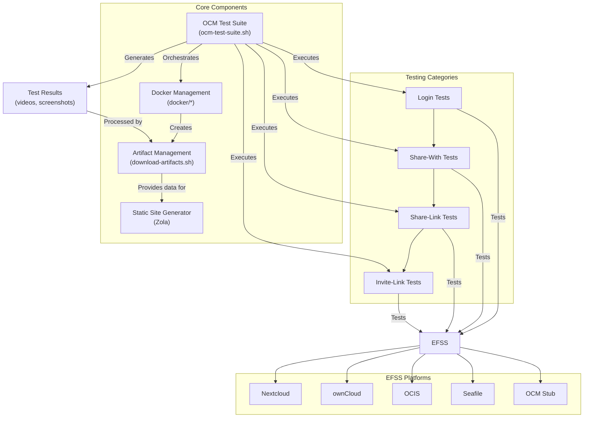
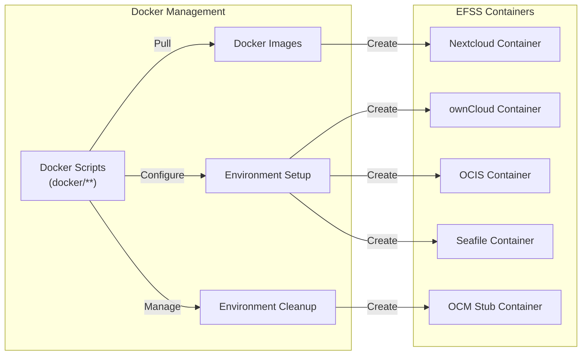
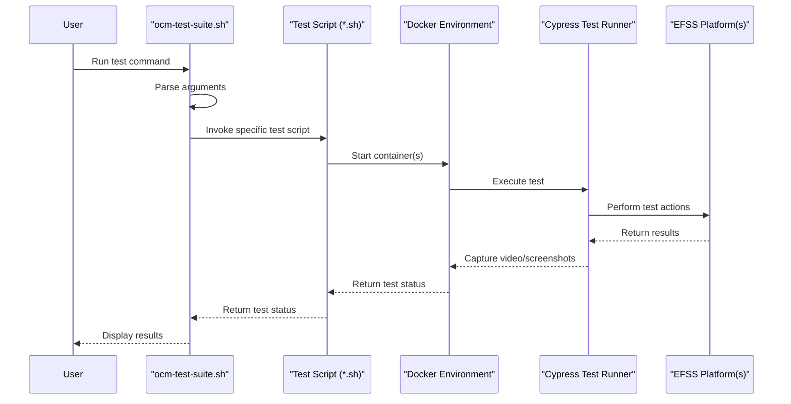

# Overview

The Development Stock (dev-stock) repository is a comprehensive toolkit designed for developing and testing interoperability between Enterprise File Synchronization and Sharing (EFSS) platforms. It focuses primarily on testing implementations of the Open Cloud Mesh (OCM) standard, which enables federated sharing between different EFSS systems.

This page provides a high-level overview of the repository's purpose, components, and functionality. For detailed information about specific subsystems, please refer to their respective pages.

# Purpose and Scope
Development Stock addresses several key challenges in EFSS interoperability testing:

1. Creating consistent, reproducible test environments for multiple EFSS platforms
2. Automating cross-platform testing of federated sharing capabilities
3. Collecting and visualizing test results for evaluation
4. Enabling developers to easily test and validate OCM implementations

The toolkit provides pre-configured Docker environments, automated test suites, and result visualization tools to enable comprehensive interoperability testing across platforms such as Nextcloud, ownCloud, OCIS, Seafile, and OCM Stub.


# System Architecture
The following diagram illustrates the high-level architecture of the Development Stock system:



# Key Components
### 1. OCM Test Suite
The OCM Test Suite is the central component responsible for orchestrating and executing tests across different EFSS platforms. It supports several test categories:

| Test Category | Description                                                             | Example Command                                                                                              |
|---------------|-------------------------------------------------------------------------|--------------------------------------------------------------------------------------------------------------|
| Login         | Tests basic authentication against an EFSS platform                     | `./dev/ocm-test-suite.sh login nextcloud v30.0.2 dev chrome`                                                 |
| Share-With    | Tests federated sharing between two EFSS platforms                      | `./dev/ocm-test-suite.sh share-with nextcloud v30.0.2 owncloud v10.x dev chrome`                             |
| Share-Link    | Tests sharing via public links between platforms                        | `./dev/ocm-test-suite.sh share-link nextcloud v30.0.2 owncloud v10.x dev chrome`                             |
| Invite-Link   | Tests invitation‑based sharing between platforms                        | `./dev/ocm-test-suite.sh invite-link nextcloud v30.0.2 owncloud v10.x dev chrome`                            |

### 2. Docker Management
The Docker management system provides containerized environments for various EFSS platforms. This ensures consistent, isolated testing environments and simplifies the setup process.



### 3. Test Flow and Execution
The following diagram illustrates how tests are executed using the OCM Test Suite:



# Supported Platforms
Development Stock currently supports the following EFSS platforms and versions:

| Platform  | Supported Versions | Notes                       |
|-----------|--------------------|-----------------------------|
| Nextcloud | v27.x, v28.x, v30.x| Full OCM support            |
| ownCloud  | v10.x              | Full OCM support            |
| OCIS      | v5.x               | Experimental OCM support    |
| Seafile   | v11.x              | Limited OCM support         |
| OCM Stub  | v1.x               | Reference implementation    |

> **Compatibility note:** Platform compatibility varies by test type. Not all platform combinations are supported for all test categories. For example, **Seafile** has limitations with `share-with`, `share-link`, and `invite-link` tests when paired with **Nextcloud** or **ownCloud**.

# Getting Started
To start using Development Stock, you can follow these steps:

1. Clone the repository:
```sh
git clone https://github.com/pondersource/dev-stock.git
cd dev-stock
```

2. Pull required Docker images:
```sh
./docker/pull/all.sh
```
3. Run a test:
```sh
./dev/ocm-test-suite.sh login nextcloud v30.0.2 dev chrome
```

For more detailed information on setting up and using Development Stock, refer to the Development Guide.

# Related Topics
For more detailed information about specific components and functionality, please refer to:

- OCM Test Suite Architecture - Detailed description of the test suite architecture
- Docker Management - More information about Docker management
- CI/CD Pipeline - Details about the CI/CD integration
- Result Visualization - Information about test result visualization
- Development Guide - Guide for developers using and contributing to the toolkit