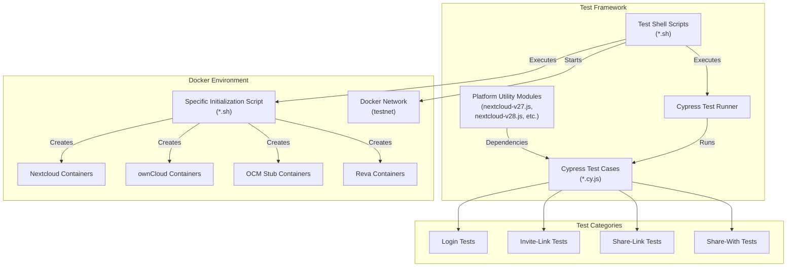
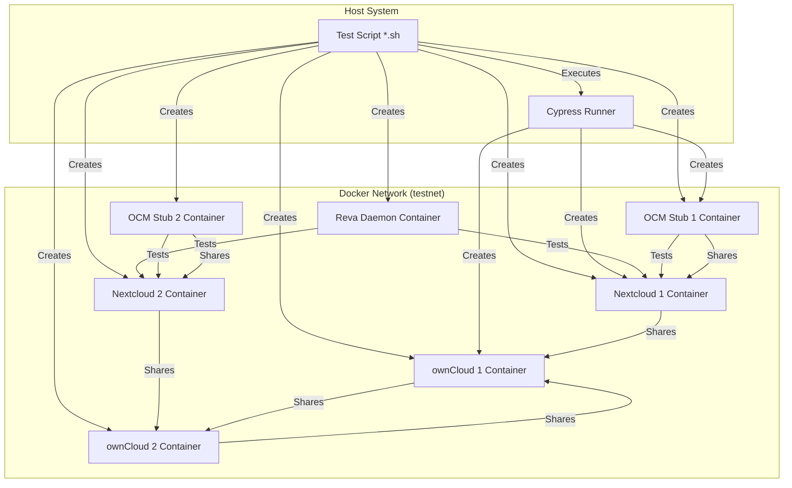

# OCM Test Suite Architecture

This document describes the architecture of the OCM (Open Cloud Mesh) Test Suite, which is designed to test federated sharing functionality between different Enterprise File Synchronization and Sharing (EFSS) platforms like Nextcloud, ownCloud, and OCM Stub. For information about specific test categories, see [Test Categories](./2.2-test-categories.md). For platform compatibility details, see [Platform Compatibility](./2.3-platform-compatibility.md).

## Core Components and Design
The OCM Test Suite consists of several interconnected components that work together to create isolated test environments, execute tests, and report results.

### High-Level Architecture



### Test Execution Flow

```mermaid
flowchart LR
    Start([Start Test Suite])
    Init["Initialize Environment<br/>setup()"]
    CreateEFSS["Create EFSS Containers<br/>create_nextcloud()<br/>create_owncloud()<br/>create_ocmstub()"]
    Mode{{Script&nbsp;Mode?}}
    CiStep["run_ci()<br/>Automated Testing"]
    CiHeadless["cypress run<br/>Headless Tests"]
    DevStep["run_dev()<br/>Interactive Testing"]
    DevOpen["cypress open<br/>Interactive Browser"]
    ExecCases["Execute Test Cases<br/>*.cy.js"]
    Utilities["Access Platform Utilities<br/>nextcloud‑v27.js<br/>nextcloud‑v28.js<br/>general.js"]
    Actions["Perform Test Actions<br/>createShare()<br/>acceptShare()<br/>ensureFileExists()"]
    Verify["Verify Expected Results<br/>cy.should()"]
    CleanEnv["Clean Environment"]
    EndTS([End Test Suite])

    Start --> Init
    Init --> CreateEFSS
    CreateEFSS --> Mode

    Mode -->|ci| CiStep
    CiStep --> CiHeadless
    CiHeadless --> ExecCases

    Mode -->|dev| DevStep
    DevStep --> DevOpen
    DevOpen --> ExecCases

    ExecCases --> Utilities
    Utilities --> Actions
    Actions --> Verify
    Verify --> CleanEnv
    CleanEnv --> EndTS
```



## Platform-Specific Utilities
The test suite includes utility modules that abstract platform-specific operations, providing a consistent interface for test cases regardless of the EFSS platform or version being tested.

### Platform-Specific Adaptations
Each EFSS platform and version has unique UI elements and API endpoints. The utility modules provide version-specific implementations of common operations to ensure tests remain compatible across different platforms.

For example, compare the implementation of ensureFileExists between Nextcloud v27 and v28:

**Nextcloud v27**:
```js
export function ensureFileExistsV27(fileName, timeout = 10000) {
  const escapedFileName = escapeCssSelector(fileName);
  cy.get(`[data-file="${escapedFileName}"]`, { timeout })
    .should('exist')
    .and('be.visible');
}
```

**Nextcloud v28:**
```js
export function ensureFileExistsV28(fileName, timeout = 10000) {
  const escapedFileName = escapeCssSelector(fileName);
  cy.get(`[data-cy-files-list-row-name="${escapedFileName}"]`, { timeout })
    .should('exist')
    .and('be.visible');
}
```
This approach allows the test suite to maintain compatibility with different platform versions while keeping the test cases themselves version-agnostic.

## Docker Management
The OCM Test Suite heavily relies on Docker to create isolated, reproducible test environments. This ensures consistent test results and eliminates dependencies on external systems.

### Docker Container Architecture



### Docker Image Management
The test suite uses custom Docker images for each EFSS platform:

| Platform  | Docker Image              | Configuration                                             |
|-----------|---------------------------|-----------------------------------------------------------|
| Nextcloud | pondersource/nextcloud    | Custom image with pre‑installed OCM app                   |
| ownCloud  | pondersource/owncloud     | Custom image with pre‑installed OCM app                   |
| OCM Stub  | pondersource/ocmstub      | Simplified OCM implementation for testing                 |
| Reva      | *Custom build*            | Built from source during initialization                   |


Each container is configured with appropriate networking settings to allow communication between the EFSS platforms while maintaining isolation from the host system.

## Test Categories
The OCM Test Suite tests various federated sharing operations across different EFSS platforms. The test categories focus on different aspects of federated sharing:

### Share-With Tests
These tests verify the ability to share files with users on remote EFSS instances using the OCM protocol.

For example, a test case for sharing from OCMStub to Nextcloud:
```js
// Send a federated share
cy.visit(`${senderUrl}/shareWith?${recipientUsername}@${recipientUrl.replace(/^https?:\/\/|\/$/g, '')}`);
cy.contains(expectedMessage, { timeout: 10000 }).should('be.visible');

// Receive and verify the share
cy.loginNextcloud(recipientUrl, recipientUsername, recipientPassword);
handleShareAcceptanceV28(sharedFileName);
```

### Share-Link Tests
Share-Link tests verify the ability to create public share links and send them to users on remote EFSS instances.

### Invite-Link Tests
Invite-Link tests verify the ability to generate invitation links that can be used to establish federated sharing relationships between EFSS instances.

## Environment Setup and Execution
The OCM Test Suite includes scripts for setting up the test environment and executing tests. These scripts handle the creation and management of Docker containers, as well as the execution of Cypress tests.

### Environment Initialization
The environment initialization process involves:

1. Setting up a Docker network for container communication
2. Cloning source code for EFSS platforms
3. Building Docker images for each platform
4. Creating and configuring Docker containers

```sh
# Create Docker network
docker network inspect testnet >/dev/null 2>&1 || docker network create testnet

# Clone source code
git clone --depth 1 --branch ${BRANCH_NEXTCLOUD} ${REPO_NEXTCLOUD} nextcloud
git clone --depth 1 --branch ${BRANCH_OWNCLOUD} ${REPO_OWNCLOUD} owncloud
git clone --depth 1 --branch ${BRANCH_REVA} ${REPO_REVA} reva

# Build and setup Reva
docker run --rm -v "$(pwd)/reva:/reva-build" --workdir /reva-build golang:1.22.1-alpine \
    sh -c "apk --no-cache add git make bash && git config --global --add safe.directory /reva-build && go mod download && make revad"
```

### Test Execution
Tests can be executed in two modes:

1.**Development Mode**: Launches Cypress in interactive mode, allowing developers to view tests as they run and debug issues.
2.**CI Mode**: Runs tests in headless mode, suitable for continuous integration environments.

```sh
if [ "${SCRIPT_MODE}" = "dev" ]; then
    run_dev \
        "https://ocmstub1.docker (just click 'Log in')" \
        "https://nextcloud1.docker (username: einstein, password: relativity)"
else
    run_ci "${TEST_SCENARIO}" "${EFSS_PLATFORM_1}" "${EFSS_PLATFORM_2}"
fi
```

## Conclusion
The OCM Test Suite architecture provides a robust framework for testing federated sharing functionality between different EFSS platforms. By leveraging Docker containers for environment isolation and Cypress for test automation, the suite ensures consistent and reliable test results.

The modular design, with platform-specific utility modules and standardized test categories, allows the suite to be extended to support new EFSS platforms and versions with minimal changes to existing test cases.