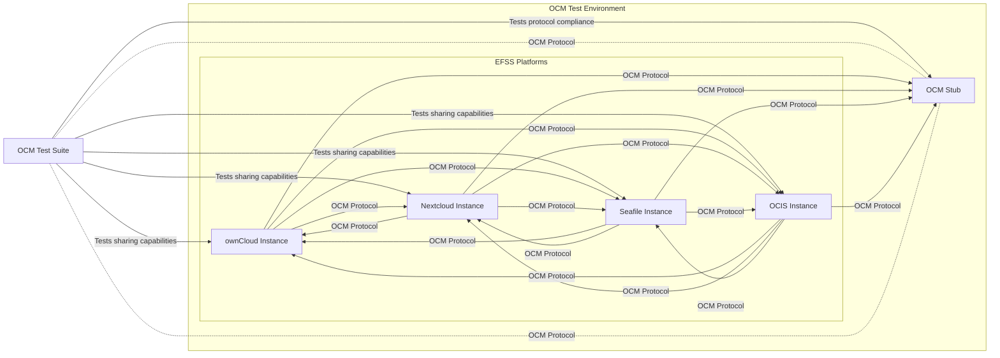
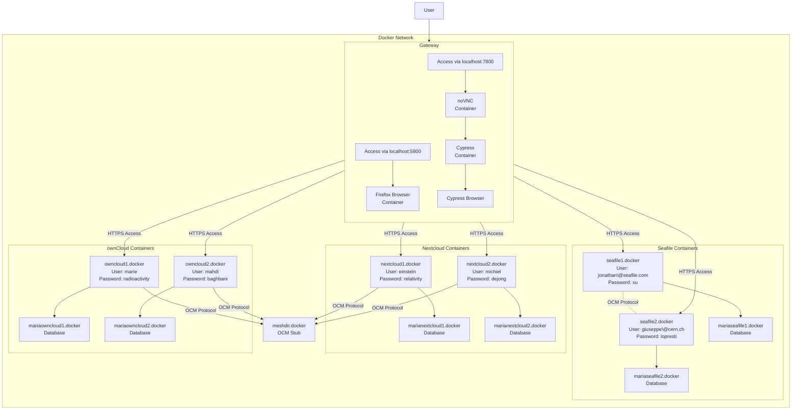
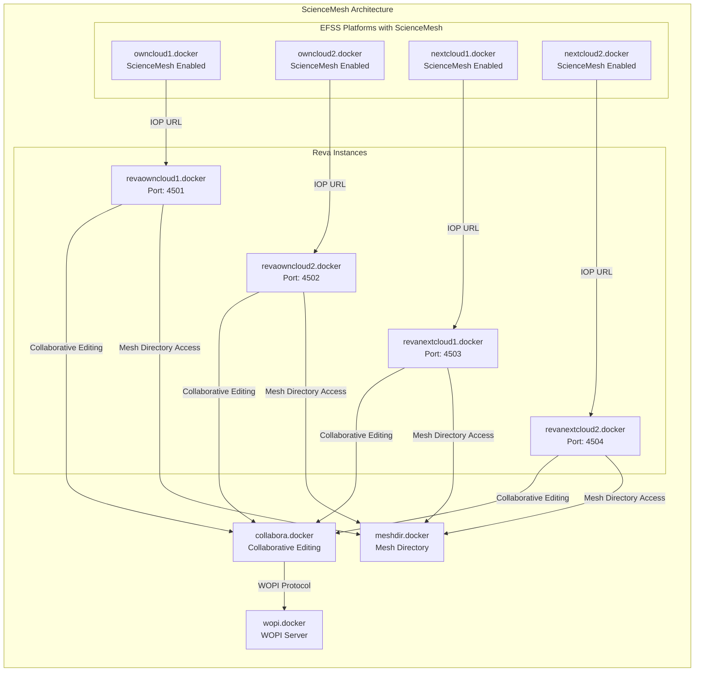

# Platform Compatibility

This document details the EFSS (Enterprise File Synchronization and Sharing) platforms that are supported by the OCM Test Suite, their versions, and the compatibility between different platforms. For information about test categories and specific test cases, see Test Categories.

## Supported EFSS Platforms
The OCM Test Suite supports testing of interoperability between the following EFSS platforms:

| Platform  | Description                                                                                          | Docker Image                       |
|-----------|------------------------------------------------------------------------------------------------------|------------------------------------|
| ownCloud  | Self‑hosted file sync & sharing platform with enterprise features                                    | pondersource/dev-stock-owncloud    |
| Nextcloud | Fork of ownCloud with extended functionality                                                         | pondersource/dev-stock-nextcloud   |
| Seafile   | Open‑source file sync and share solution focused on performance                                      | seafileltd/seafile-mc              |
| OCIS      | ownCloud Infinite Scale, next‑gen cloud platform                                                     | pondersource/dev-stock-ocis        |
| OCM Stub  | Lightweight OCM protocol implementation for testing                                                  | pondersource/dev-stock-ocmstub     |

## Platform Versions
### Supported Versions Matrix
| Platform  | Tested Versions           | Default Version |
|-----------|---------------------------|-----------------|
| ownCloud  | 10.x                      | Latest 10.x     |
| Nextcloud | 27.x, 28.x, 29.x          | Latest stable   |
| Seafile   | v11.0.5                   | v11.0.5         |
| OCIS      | Latest                    | Latest          |
| OCM Stub  | Latest                    | Latest          |

## Platform Architecture and Integration
### Platform Architecture Overview
The diagram below illustrates how the various EFSS platforms integrate with the OCM ecosystem:

### Deployment Architecture
This diagram shows how the platforms are deployed and interconnected in the test environment, this is just a demonstration of gerneral top level idea and is not exactly what happens in the tests:

## Testing Environment Setup
### Browser Compatibility
The OCM Test Suite testing environment has been configured to work with the following browsers:

- Firefox (primary browser in the Docker environment)
- Chrome (supported in Cypress tests)
- Edge (supported in Cypress tests)
- Electron (default for Cypress tests)

The environment includes pre-configured browser settings to handle self-signed certificates for all EFSS platforms.

### Platform-Specific Extensions and Apps
Different EFSS platforms require specific apps or extensions to be compatible with the OCM protocol:

| Platform  | Required Apps/Extensions                                                                                           |
|-----------|--------------------------------------------------------------------------------------------------------------------|
| ownCloud  | - opencloudmesh - federatedgroups (for federated group testing) - customgroups (for federated group testing) |
| Nextcloud | - opencloudmesh - solid (for Solid protocol support)                                                            |
| Seafile   | Native OCM support                                                                                                 |

## ScienceMesh Integration
The OCM Test Suite also includes support for ScienceMesh, which extends EFSS platforms with additional collaborative features:

## Platform Configuration
### Default User Accounts
Each EFSS platform is preconfigured with default user accounts for testing:

| Platform Instance  | Username               | Password     |
|--------------------|------------------------|--------------|
| owncloud1.docker   | marie                  | radioactivity|
| owncloud2.docker   | mahdi                  | baghbani     |
| nextcloud1.docker  | einstein               | relativity   |
| nextcloud2.docker  | michiel                | dejong       |
| seafile1.docker    | jonathan@seafile.com   | xu           |
| seafile2.docker    | giuseppe@cern.ch       | lopresti     |

### Database Configuration
All EFSS platforms are configured with MariaDB databases:

| Database Container      | EFSS Container    | Purpose                                 |
|-------------------------|-------------------|-----------------------------------------|
| mariaowncloud1.docker   | owncloud1.docker  | Database for ownCloud instance 1        |
| mariaowncloud2.docker   | owncloud2.docker  | Database for ownCloud instance 2        |
| marianextcloud1.docker  | nextcloud1.docker | Database for Nextcloud instance 1       |
| marianextcloud2.docker  | nextcloud2.docker | Database for Nextcloud instance 2       |
| mariaseafile1.docker    | seafile1.docker   | Database for Seafile instance 1         |
| mariaseafile2.docker    | seafile2.docker   | Database for Seafile instance 2         |

## OCM Protocol Implementation
Each EFSS platform implements the OCM (Open Cloud Mesh) protocol, which enables file sharing between different platforms. The platforms have varying levels of OCM protocol implementation:

| Platform  | OCM Implementation                                                    | Support Level             |
|-----------|-----------------------------------------------------------------------|---------------------------|
| ownCloud  | Native implementation + Invite link with ScienceMesh plugint          | Semi-Full support         |
| Nextcloud | Native implementation + Invite link with ScienceMesh plugint          | Semi-Full support         |
| Seafile   | Native implementation                                                 | Minimum support           |
| OCIS      | Native implementation + Native invite link support                    | Full support              |
| OCM Stub  | Reference implementation + No Invite link support yet                 | Protocol testing only     |

In summary, the OCM Test Suite provides comprehensive compatibility testing across multiple EFSS platforms, ensuring interoperability through the OCM protocol. The testing environment is configured to support various scenarios, including standard file sharing, federated groups, and ScienceMesh integration.
