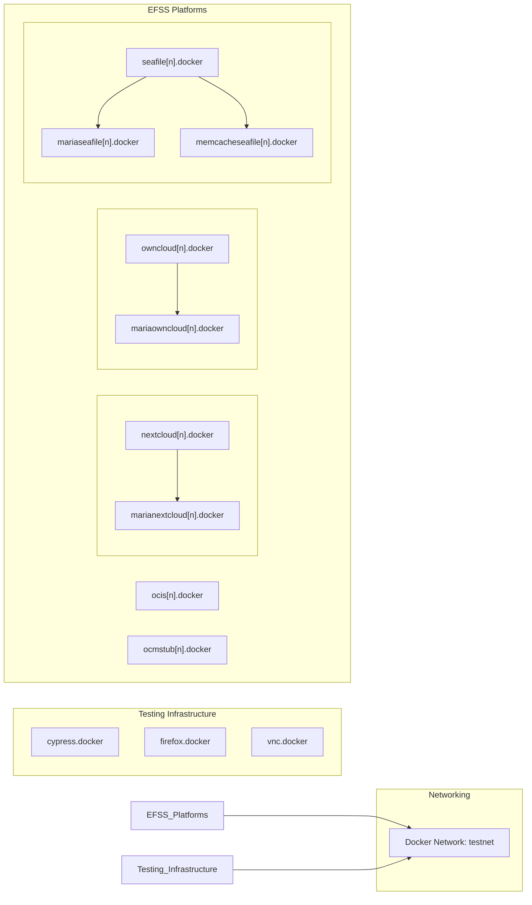
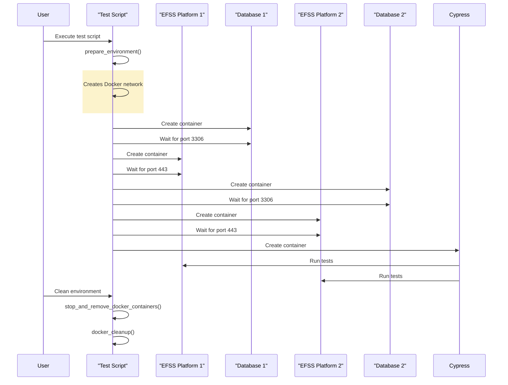
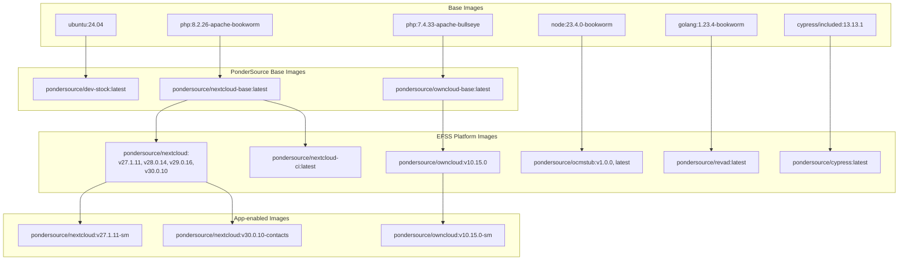
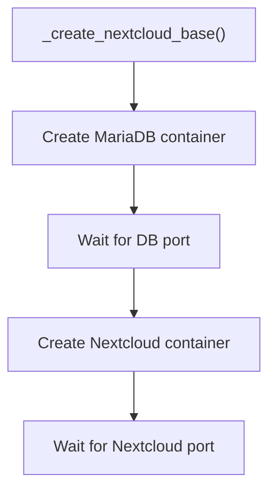

# Docker Management
## Purpose and Scope
This page documents the Docker management system used in the dev-stock repository. It covers the creation, configuration, and lifecycle management of Docker containers and images used for testing Enterprise File Synchronization and Sharing (EFSS) platforms for OCM compatibility.

For specific information about running tests with these Docker containers, see [OCM Test Suite Architecture](./2-architecture.md). For environment setup instructions, see [Environment Management](./3.3-environment-management.md).

## Overview
The Docker management system in dev-stock provides a containerized environment for testing OCM compatibility between various EFSS platforms. It manages:

1. Multiple EFSS platform containers (Nextcloud, ownCloud, Seafile, OCMStub, OCIS)
2. Supporting containers (MariaDB, Firefox, VNC, Redis, Memcached)
3. Test orchestration containers (Cypress)
4. Container networks, volumes, and persistent storage

The system handles the entire Docker lifecycle including building, pulling, pushing, creating, configuring, and cleaning up containers.

## Docker Architecture
### Container Organization

### Container Interaction Flow

## Docker Image Management
### Image Hierarchy

### Image Building
The system builds multiple Docker images using the [`build_docker_image function`](https://github.com/pondersource/dev-stock/blob/9ba01db9fae258961b05b6d69579a5c08c0417ec/docker/build/all.sh#L113-L150) in
This function handles:

1. Validating Dockerfile existence
2. Building with cache-busting for CI
3. Tagging images with appropriate version tags
4. Error handling and reporting

For application-specific images, specialized functions exist:

- [`build_nextcloud_app_image()`](https://github.com/pondersource/dev-stock/blob/9ba01db9fae258961b05b6d69579a5c08c0417ec/docker/build/all.sh#L152-L212) 
- [`build_owncloud_app_image()`](https://github.com/pondersource/dev-stock/blob/9ba01db9fae258961b05b6d69579a5c08c0417ec/docker/build/all.sh#L214-L274) 

### Key Image Versions
| Platform      | Supported Versions                              |
|---------------|-------------------------------------------------|
| Nextcloud     | v27.1.11, v28.0.14, v29.0.16, v30.0.10          |
| ownCloud      | v10.15.0                                        |
| OCM Stub      | v1.0.0, latest                                  |
| Revad         | latest                                          |
| Contacts App  | Matched to NC versions                          |

### Image Distribution
The system includes complete image management with:

1. **Building**: Using `docker/build/all.sh`
2. **Pulling**: Using `docker/pull/all.sh`
3. **Pushing**: Using `docker/push/all.sh`

## Container Lifecycle Management
### Container Creation
The container creation system follows a consistent pattern:

1. Create dependency containers first (databases, caches)
2. Set appropriate environment variables
3. Mount volumes and certificates
4. Create main EFSS container
5. Wait for service readiness via port checks

Example from Nextcloud container creation:

### Container Deletion
The container deletion system follows an equally consistent pattern:

1. Stop containers
2. Collect attached named volumes
3. Remove containers with `-v` flag (removes anonymous volumes)
4. Remove named volumes explicitly
5. Clean up related resources

This pattern is implemented for all container types with specific functions like:

- [`delete_nextcloud()`](https://github.com/pondersource/dev-stock/blob/9ba01db9fae258961b05b6d69579a5c08c0417ec/scripts/utils/container/nextcloud.sh#L145-L189) 

- [`delete_ocis()`](https://github.com/pondersource/dev-stock/blob/9ba01db9fae258961b05b6d69579a5c08c0417ec/scripts/utils/container/ocis.sh#L119-L148)

- [`delete_seafile()`](https://github.com/pondersource/dev-stock/blob/9ba01db9fae258961b05b6d69579a5c08c0417ec/scripts/utils/container/seafile.sh#L74-L105)

### Environment Cleanup
The system provides both targeted and complete cleanup functionality:

1. **Targeted cleanup**: Delete specific containers by platform and number
2. **Complete cleanup**: Remove all containers and prune Docker resources

The clean script (`scripts/clean.sh`) implements this with:

- `stop_and_remove_docker_containers()` for complete cleanup
- `docker_cleanup()` for volume and system pruning
- Platform-specific deletion functions called dynamically

## EFSS Platform Containers
### Nextcloud
Nextcloud containers are created with a MariaDB backend and support both standard and development configurations through:

- `create_nextcloud()`: Standard container creation
- `create_nextcloud_dev()`: Development container with volume mounting

Configuration includes:

- MariaDB database connection
- Admin user credentials
- SSL certificate mounting
- Trusted domains setup
- Support app installations (like ScienceMesh)

### ownCloud
Similar to Nextcloud, ownCloud containers:

- Use MariaDB backend
- Configure admin credentials
- Set up SSL and trusted domains
- Support app installations (like ScienceMesh)
Sources:

### Seafile
Seafile has a more complex setup:

- MariaDB database backend
- Memcached for caching
- Custom initialization script
- SSL certificate configuration

### OCIS
OCIS configuration focuses on:

- OCM provider configuration
- SSL certificate setup
- Specialized environment variables for OCM federation
- No database backend (uses internal storage)

### OCMStub
OCMStub is a minimal implementation used for testing:

- Simplified container setup
- TLS certificate mounting
- Basic hostname configuration

## Supporting Infrastructure
### Test Containers
The system includes container management for:

1. **Cypress**: For automated UI testing
2. **Firefox**: For interactive browser testing
3. **VNC**: For remote viewing of browser sessions

These supporting containers connect to the same Docker network to enable communication with EFSS containers.

### Network Management
A dedicated Docker network (`testnet`) is created and managed to:

- Isolate test environments
- Enable container-to-container communication
- Provide DNS resolution between containers
The network is recreated during cleanup to ensure a clean state for new tests.

## Best Practices
The Docker management system follows several best practices:

1. **Isolated environments**: Each test runs in isolated containers
2. **Clean teardown**: Complete cleanup after tests
3. **Wait for readiness**: Port checks ensure services are running
4. **Version consistency**: Building and maintaining specific versions
5. **Resource management**: Proper handling of volumes and networks

The code implements consistent error handling and verbosity control suitable for both development and CI environments.
