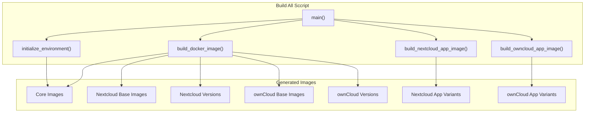
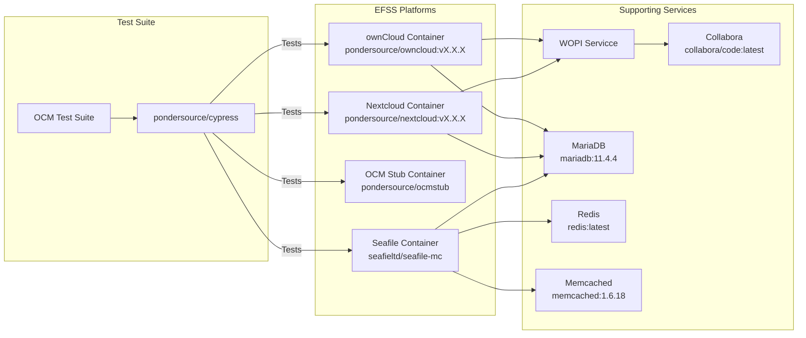

# Docker Images

## Purpose and Scope
This document details the Docker images used in the dev-stock repository for testing EFSS (Enterprise File Synchronization and Sharing) platform interoperability. It covers custom-built images, versioning strategies, and their relationships in the testing infrastructure. For information about managing Docker environments, see [Environment Management](./3.3-environment-management.md).

## Docker Image Ecosystem
The following diagram illustrates the Docker image hierarchy used in the testing infrastructure:

## Core Images
**pondersource/dev-stock**
Base development environment with essential tools required for the dev-stock repository.

Tag: `latest`, `v1.0.0`

**pondersource/cypress**
Contains Cypress testing framework with OCM test suite files pre-configured.

Tag: `latest`, `v1.0.0`

**pondersource/ocmstub**
OCM stub implementation used for testing OCM protocol functionality without requiring a full EFSS platform.

Tag: `latest`, `v1.0.0`

**pondersource/revad**
Contains the Revad implementation, a CS3 API-compliant storage provider.

Tag: `latest`

## EFSS Platform Images
### Nextcloud Images
#### Base Images
- **pondersource/nextcloud-base**: Foundation for all Nextcloud images
- **pondersource/nextcloud-ci**: Specialized image for Nextcloud CI testing

#### Version-Specific Images
| Image Tag                              | Description                    |
|----------------------------------------|--------------------------------|
| pondersource/nextcloud:v27.1.11        | Nextcloud v27.1.11             |
| pondersource/nextcloud:v28.0.14        | Nextcloud v28.0.14             |
| pondersource/nextcloud:v29.0.16        | Nextcloud v29.0.16             |
| pondersource/nextcloud:v30.0.11        | Nextcloud v30.0.11             |
| pondersource/nextcloud:v30.0.11        | Nextcloud v31.0.5 (latest)     |

#### App-Specific Variants
1. ScienceMesh app:
    - pondersource/nextcloud:v27.1.11-sm

3. Contacts app:
    - pondersource/nextcloud:v27.1.11-contacts
    - pondersource/nextcloud:v28.0.14-contacts
    - pondersource/nextcloud:v29.0.16-contacts
    - pondersource/nextcloud:v30.0.11-contacts
    - pondersource/nextcloud:v31.0.5-contacts

### ownCloud Images
#### Base Images
- **pondersource/owncloud-base**: Foundation for all ownCloud images

#### Version-Specific Images
| Image Tag                          | Description                |
|----------------------------------------|--------------------------------|
| pondersource/owncloud:v10.15.0         | ownCloud v10.15.0 (latest)     |

#### App-Specific Variants
1. ScienceMesh app:
    - pondersource/owncloud:v10.15.0-sm

### Third-Party Images
The following third-party images are used to support the EFSS platforms:

| Image                          | Version  | Purpose                               |
|--------------------------------|----------|---------------------------------------|
| cypress/included               | 13.13.1  | Cypress testing framework             |
| jlesage/firefox                | v24.11.1 | Firefox browser for UI testing        |
| mariadb                        | 11.4.4   | Database server                       |
| theasp/novnc                   | latest   | VNC server for remote access          |
| redis                          | latest   | Redis server for caching              |
| memcached                      | 1.6.18   | Memcached server for caching          |
| rclone/rclone                  | latest   | Cloud storage access                  |
| collabora/code                 | latest   | Document editing                      |
| cs3org/wopiserver              | latest   | WOPI server for document editing      |
| seafileltd/seafile-mc          | 11.0.5   | Seafile server                        |
| quay.io/keycloak/keycloak      | latest   | Identity provider                     |

### Image Building Process
The Docker images are built using the `docker/build/all.sh` script. This script defines specialized functions for building different types of images and handles dependencies between them.



The build process follows a specific sequence:

1. Core images (dev-stock, cypress, ocmstub, revad)
2. EFSS platform base images (nextcloud-base, owncloud-base)
3. Specific EFSS platform versions
4. App-specific variants

Key build functions:

- `build_docker_image()`: Generic Docker image builder
- `build_nextcloud_app_image()`: Specialized for Nextcloud app images
- `build_owncloud_app_image()`: Specialized for ownCloud app images

## Image Distribution
Two scripts handle image distribution:

### Pushing Images
The docker/push/all.sh script pushes images to Docker Hub.
it need a password for pondersource account.
```sh
./docker/push/all.sh
```

### Pulling Images
The `docker/pull/all.sh` script pulls images from Docker Hub with similar mode support.

```sh
# Development mode (verbose output)
./docker/pull/all.sh
```

## Image Usage in Testing Infrastructure
The following diagram illustrates how Docker images are used in the OCM testing infrastructure:



## TLS Certificate Handling
Docker images that require TLS for secure connections use the `docker/scripts/entrypoint.sh` script as their entrypoint. This script:

1. Copies certificate files from the `/certificates` directory to `/tls`
2. Creates symbolic links for the server's certificate and key
3. Executes the container's main process

Required environment variables:
- `HOST`: The hostname for TLS certificate matching

## Versioning Strategy
The Docker image versioning follows these principles:

1. Core images use explicit version tags (e.g., `v1.0.0`) and `latest`
2. EFSS platform images use version numbers matching their upstream versions (e.g., `v27.1.11`)
3. App-specific variants append the app name to the version (e.g., `v27.1.11-sm` for ScienceMesh)
4. The first element in each version array is also tagged as `latest`
