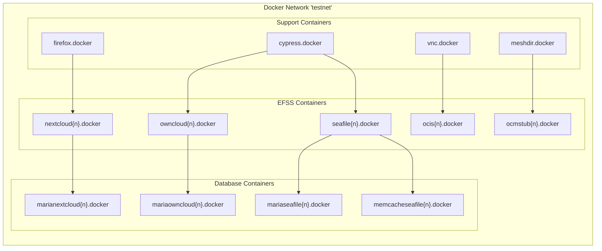

# Environment Management

This document outlines the Environment Management system in the dev-stock repository. This system is responsible for setting up, configuring, and cleaning Docker-based environments for testing EFSS (Enterprise File Synchronization and Sharing) platforms and their OCM (Open Cloud Mesh) interoperability.

For information about Docker Images used in these environments, see [Docker Images](./3.2-docker-images.md).

## Environment Management Overview
The Environment Management system provides tools and utilities for creating isolated test environments with multiple EFSS platforms (Nextcloud, ownCloud, Seafile, OCIS, OCM Stub), managing their lifecycles, and cleaning up resources after testing.


## Environment Setup
The environment setup process initializes and prepares Docker environments for testing OCM interoperability between different EFSS platforms.

### Initialization
Environment initialization is managed through the `initialize_environment()` function in `scripts/clean.sh`:

```sh
# Initialize environment
initialize_environment ".."
```

This function:
1. Resolves the script's directory using `resolve_script_dir()`
2. Changes (and `cd`) path to the specified directory `..` (it could be any other path)
3. Exports the environment root directory as `ENV_ROOT`
4. Sources utility scripts needed for environment management

### Docker Environment Preparation
Docker environment preparation is handled by the `prepare_environment()` function in `scripts/utils/docker.sh`:

```sh
# Prepare Docker environment
prepare_environment
```

This function:
1. Creates temporary directories for environment configuration
2. Optionally cleans up previous resources (controlled by NO_CLEANING environment variable)
3. Ensures the Docker network named DOCKER_NETWORK (typically "testnet") exists

## Container Structure and Management
The environment management system creates a structured set of containers connected via a Docker network.



### EFSS Platform Container Management
The system provides specialized functions for creating and managing containers for different EFSS platforms:

| Platform  | Create Function     | Delete Function     | Dependencies        |
|-----------|---------------------|---------------------|---------------------|
| Nextcloud | `create_nextcloud()`| `delete_nextcloud()`| MariaDB             |
| ownCloud  | `create_owncloud()` | `delete_owncloud()` | MariaDB             |
| Seafile   | `create_seafile()`  | `delete_seafile()`  | MariaDB, Memcached  |
| OCIS      | `create_ocis()`     | `delete_ocis()`     | None                |
| OCM Stub  | `create_ocmstub()`  | `delete_ocmstub()`  | None                |


Example of creating a Nextcloud container:

```sh
# Create Nextcloud container with MariaDB backend
create_nextcloud 1 "admin" "admin" "pondersource/nextcloud" "v30.0.0"
```

This function:
1. Creates a MariaDB container for Nextcloud (marianextcloud1.docker)
2. Waits for the MariaDB port to open
3. Creates the Nextcloud container (nextcloud1.docker) with specified configuration
4. Waits for Nextcloud to be ready

Each EFSS platform has a corresponding delete function that:
1. Stops the containers
2. Identifies any named volumes attached to the containers
3. Removes the containers and their anonymous volumes
4. Removes any named volumes discovered

### Supporting Service Container Management
The system also provides functions for managing supporting service containers:

Service	Create Function	Delete Function	Purpose
Firefox	create_firefox()	delete_firefox()	Browser for testing
VNC	create_vnc()	delete_vnc()	VNC server for remote viewing
Mesh Directory	create_meshdir()	delete_meshdir()	OCM mesh directory service
Reva	create_reva()	delete_reva()	Reva OCM integration

Example of creating supporting services:

```sh
# Create Firefox container
create_firefox

# Create VNC container for remote viewing
create_vnc
```

## Environment Cleanup
The environment cleanup process ensures that test environments are properly cleaned up after testing, managed through the `clean.sh` script.

### Targeted Cleanup
To clean up specific platforms, you can provide their names as arguments to `clean.sh`:

```sh
# Clean specific platforms (the "no" argument disables terminal clearing)
./scripts/clean.sh no nextcloud1 owncloud1 seafile1
```

This will:
1. Call the appropriate `delete_X()` function for each specified platform
2. Recreate the Docker network

The script identifies each platform's type and instance number from the provided arguments and calls the correct cleanup function.

### Complete Cleanup
To clean up all containers and resources, run `clean.sh` without platform arguments:

```sh
# Clean all containers and resources
./scripts/clean.sh
```

This performs a more thorough cleanup:
1. Stops and removes all Docker containers via `stop_and_remove_docker_containers()`
2. Cleans up unused Docker volumes and system resources via `docker_cleanup()`
3. Recreates the Docker network via `recreate_docker_network("testnet")`

### Skipping Cleanup
To skip cleanup (useful during development), set the `NO_CLEANING` environment variable to "true":

```sh
# Skip cleanup
export NO_CLEANING=true
./scripts/clean.sh
```

## Development Environment Configuration
The environment management system includes configuration for both local and cloud-based development environments.

### Gitpod Configuration
For cloud-based development using Gitpod, configuration is provided in:

- `.gitpod.yml`: Defines IDE extensions, exposed ports, and initialization tasks
- `.gitpod.Dockerfile`: Defines the Docker image for the workspace
Key port configurations in Gitpod:

```yaml
ports:
  - port: 4501-4506
    onOpen: ignore
    visibility: public
  - port: 5700
    onOpen: ignore
    visibility: public
    name: VNC
    description: VNC server to view Cypress.
  - port: 5800
    onOpen: ignore
    visibility: public
    name: FireFox
    description: Embedded browser to access docker containers.
  - port: 9003
    onOpen: ignore
    visibility: public
    name: Xdebug
    description: Xdebug client port.
```

The Gitpod environment automatically runs `init/prebuild.sh` during initialization, which sets up the development environment by pulling required Docker images.

### CI Environment Configuration
For automated testing in CI environments, configuration is provided in `scripts/utils/test_modes/ci.sh`:

```sh
# Run tests in CI mode
run_ci
```

This function:
1. Validates arguments based on the test scenario
2. Adjusts Cypress configurations for the specified browser platform
3. Runs Cypress tests in headless mode
4. Cleans up the test environment (unless `NO_CLEANING=true`)

### PHP Debugging Configuration
For PHP debugging in development environments, Xdebug configuration is provided in `docker/configs/20-xdebug.ini`:

```php
zend_extension=xdebug.so
xdebug.mode="develop,debug,coverage"
xdebug.start_with_request = yes
xdebug.client_host = "host.docker.internal"
xdebug.client_port = "9003"
xdebug.idekey="VSCODE"
xdebug.log=/var/www/html/xdebug.log
xdebug.log_level = 0
```

This configuration enables debugging PHP code in EFSS platforms, with the client host set to the Docker host machine.

## Common Operations
Here are some common operations for managing test environments:

### Creating a Complete Test Environment
To create a complete test environment for OCM testing between two EFSS platforms:

1. Initialize the environment
2. Create the first EFSS platform container
3. Create the second EFSS platform container
4. Create supporting service containers
5. Run tests
6. Clean up the environment

### Managing Container Lifecycle
The typical lifecycle of a container in the test environment:

1. **Creation**: Call the appropriate `create_X()` function
2. **Usage**: Run tests against the container
3. **Cleanup**: Call the appropriate `delete_X()` function or use `clean.sh`

### Special Configurations
Some EFSS platforms require special configurations:

1. **OCIS**: Requires preparation via `prepare_ocis_environment()` before creating containers
2. **Seafile**: Requires additional initialization script execution inside the container
3. **Nextcloud**: Offers a development mode via `create_nextcloud_dev()` for volume mounting
