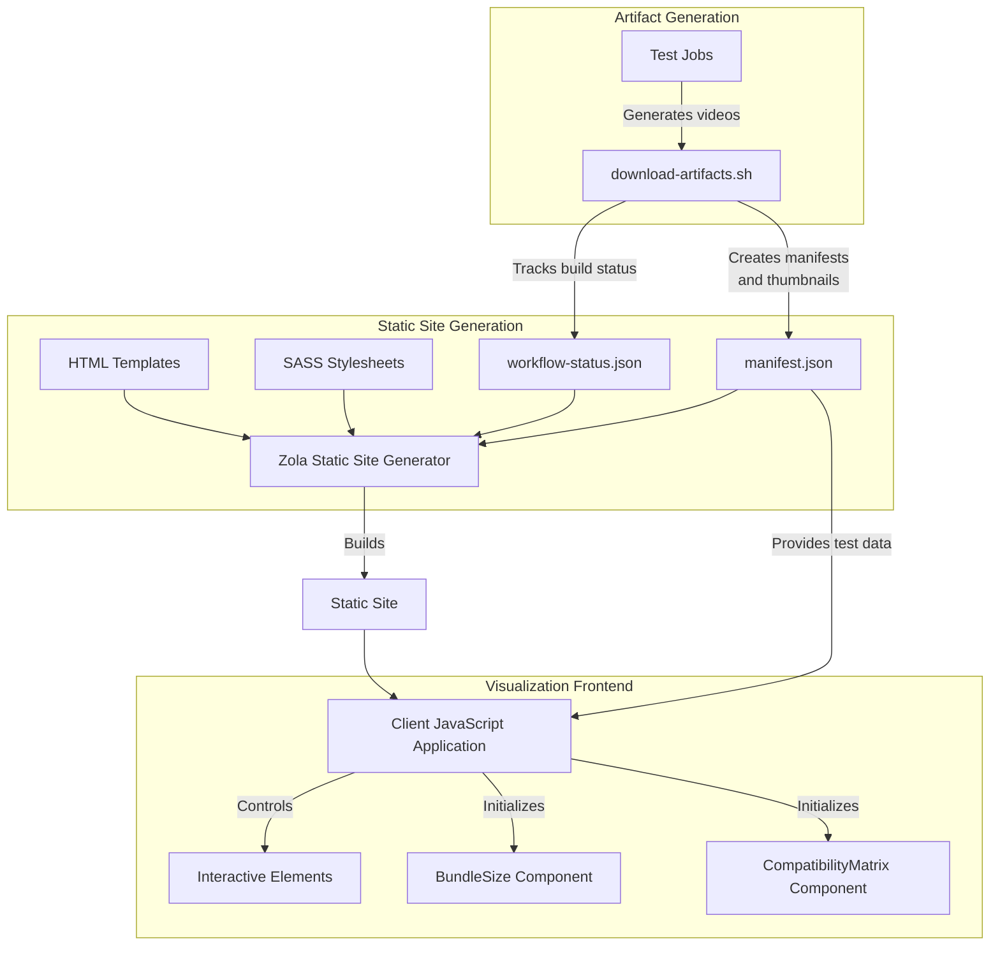
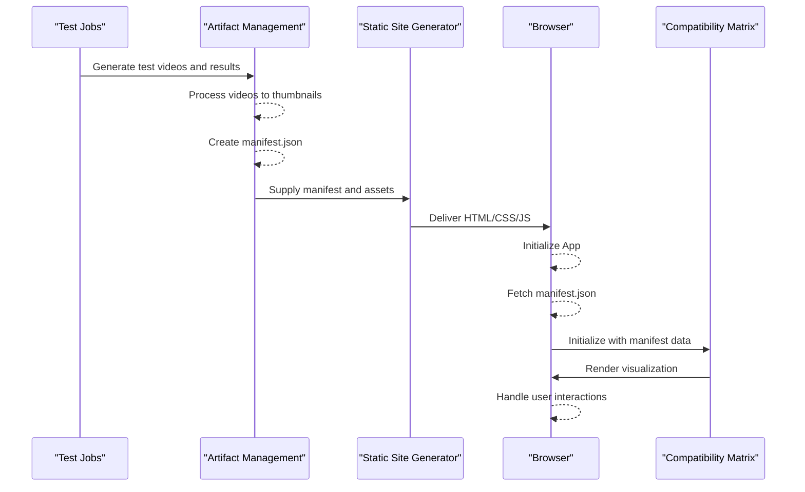
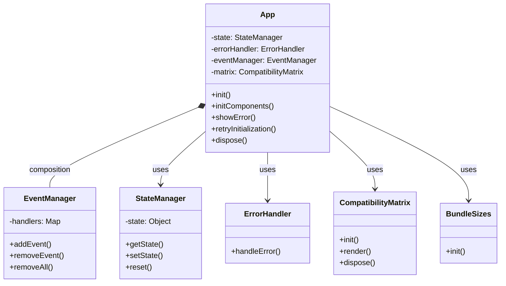
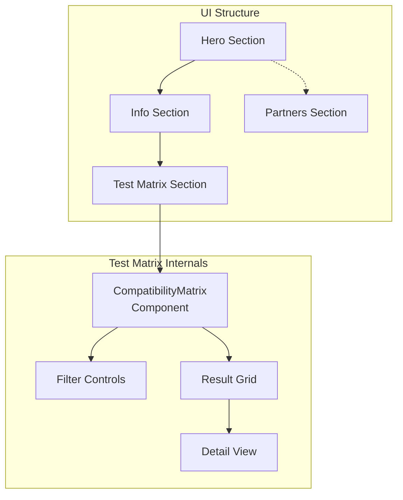

# Result Visualization
## Overview and Purpose
The Result Visualization system transforms OCM test results into an interactive and visually accessible format. This component serves as the final stage in the testing pipeline, taking the raw test artifacts and presenting them through a web-based interface deployed on GitHub Pages. The system enables users to explore test results across different EFSS platforms and test scenarios without needing to download and review individual test artifacts.

## Architecture Overview
The Result Visualization system uses a static site generator (Zola) with client-side JavaScript to create an interactive report of test results. The system consists of several interconnected components that work together to present test results in a meaningful way.

### High-Level Architecture



## Data Flow
The Result Visualization system relies on structured data flowing from the test execution environment to the browser-based visualization interface. Below is a diagram illustrating this flow:



## Core Components
### Client Application
The client-side application serves as the entry point for the visualization system. It manages the initialization, state, and error handling of the visualization components.



The App class orchestrates the initialization process, handling errors and managing the application state. It first fetches the manifest file that contains information about test videos and results, then initializes the visualization components.

### Compatibility Matrix
The Compatibility Matrix is the primary visualization component, displaying test results across different EFSS platforms and test scenarios. The matrix provides a visual overview of which tests passed, failed, or were skipped for each platform.

Key responsibilities:

- Initialize with test data from the manifest
- Render a grid of test results
- Provide filtering and sorting capabilities
- Handle user interactions for viewing detailed results

### Bundle Sizes Component
This component visualizes the size of test artifact bundles, allowing users to understand the storage impact of different test artifacts.

## Initialization Process
The Result Visualization system follows a structured initialization process:

1. When the DOM is loaded, the main application class is instantiated
2. The application attempts to fetch the manifest file containing test data
3. Upon successful manifest retrieval, the visualization components are initialized
4. The Compatibility Matrix is rendered with test data
5. The application enters the initialized state, ready for user interaction

```mermaid
stateDiagram-v2
    [*] --> "DomLoaded"

    "DomLoaded" --> "Loading"
    "Loading" --> "FetchingManifest" : App init
    "FetchingManifest" --> "InitializingComponents" : Manifest loaded
    "InitializingComponents" --> "RenderingMatrix"   : Components ready
    "RenderingMatrix" --> "Initialized"             : Rendering complete


    "FetchingManifest" --> "Error" : Fetch failed
    "Error" --> "Retry"            : User retry
    "Retry" --> "FetchingManifest"
    
    "Initialized" --> "Disposed" : Dispose
    "Disposed" --> [*]
```

## Error Handling
The visualization system implements robust error handling to address potential issues during initialization or operation. The error handling strategy includes:

| Error Type                   | Strategy | Description                                                             |
|------------------------------|----------|-------------------------------------------------------------------------|
| Manifest fetch failure       | Retry    | Allows user‑initiated retry of manifest fetching                         |
| Invalid manifest format      | Notify   | Displays error message to user about malformed data                     |
| Component initialization failure | Reload   | Attempts to reload the application                                     |
| Runtime error                | Notify   | Displays error with context and recovery options                        |

Error messages are displayed in the gallery container, providing actionable feedback to users.

## User Interface Components
The Result Visualization user interface consists of several sections that provide different views of the test results:

1. **Hero Section**: Landing area with overview and resources
2. **Partners Section**: Information about project collaborators
3. **Info Section**: Details about the OCM test framework
4. **Test Matrix**: Main visualization of test results across platforms



## Performance Optimizations
The visualization system employs several performance optimization techniques to ensure a smooth user experience:

1. **DOM Management**: A dedicated DOMManager class caches DOM elements to reduce repeated DOM queries
2. **Event Management**: The EventManager class provides optimized event handling with debounce and throttle capabilities
3. **Lazy Loading**: Test videos and thumbnails are loaded on-demand rather than upfront
4. **Animation Frame Management**: Animations and visual updates are synchronized with browser render cycles

These optimizations help maintain responsiveness even when displaying large test result datasets.

## Integration with Test Orchestration
The Result Visualization system integrates with the Test Orchestration system to consume test artifacts and display them in a meaningful way. The key touchpoints include:

1. **Manifest File**: Contains metadata about test executions, results, and artifacts
2. **Video Thumbnails**: Visual snapshots of test execution videos for quick preview
3. **Bundle Artifacts**: ZIP files containing full test logs and videos for detailed analysis
This integration ensures that test results are properly contextualized and accessible through the visualization interface.

## Conclusion
The Result Visualization system provides a crucial link between test execution and human interpretation by transforming raw test artifacts into an accessible, interactive web interface. Through its component architecture, error handling, and performance optimizations, it enables users to efficiently analyze test results across different EFSS platforms and test scenarios.

The system's modular design allows for future extensions to support additional visualization components or test result types as the OCM Test Suite evolves.
