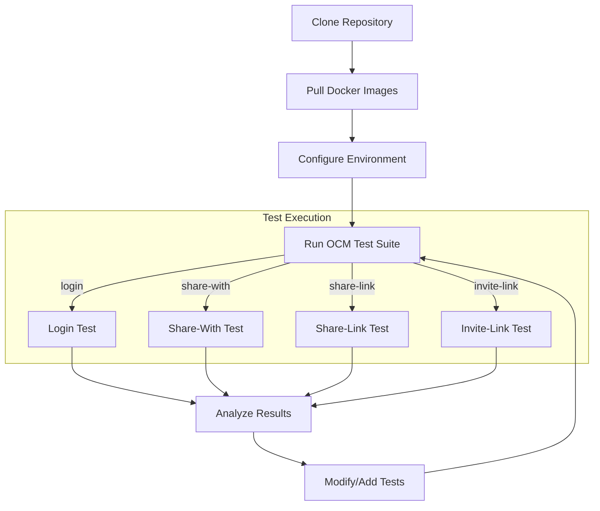
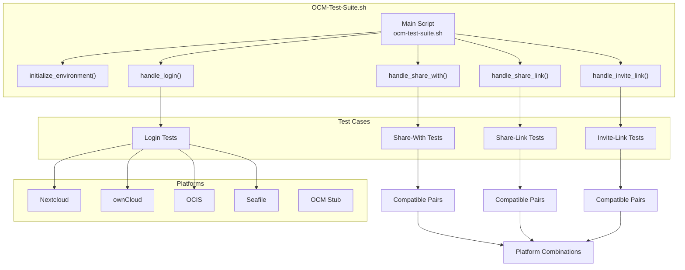
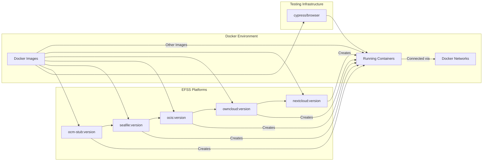
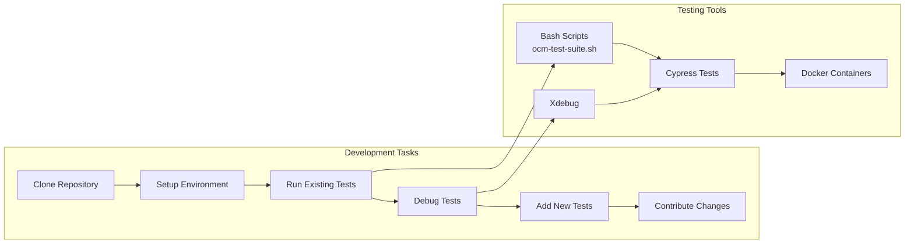

# Development Guide
## Purpose and Scope
This guide provides comprehensive instructions for developers working with the Development Stockpile (dev-stock) repository. It covers setting up a local development environment, running OCM test suites, debugging, and contributing to the project. This document focuses on the developer experience rather than the technical architecture of the system. For information about the overall OCM Test Suite Architecture, see [OCM Test Suite Architecture](./2-architecture.md), and for details about Docker Management, see [Docker Management](./3-docker-management.md).

## Setting Up the Development Environment
### Local Environment Setup
Setting up a local development environment involves cloning the repository and pulling the required Docker images.

```sh
# Clone the repository
git clone https://github.com/pondersource/dev-stock.git
cd dev-stock

# Pull required Docker images
./docker/pull/all.sh
```

### Development Workflow
Below is an overview of the typical development workflow when working with the dev-stock repository.



### Gitpod Setup
For cloud-based development, the repository supports Gitpod. The Gitpod configuration automatically sets up the development environment with necessary tools and Docker images.

1. Open the repository in Gitpod by navigating to `https://gitpod.io/#https://github.com/pondersource/dev-stock`
2. Gitpod will automatically run the prebuild script to set up the environment
3. Use the integrated terminal to run tests and work with the codebase

The Gitpod setup includes:

- Docker support
- PHP with Xdebug
- GitHub Action runner (act)
- Exposed ports for testing


## Understanding the OCM Test Suite
The OCM Test Suite is the core component of the dev-stock repository. It provides automated testing capabilities for EFSS platforms' interoperability using the Open Cloud Mesh standard.

### Test Suite Architecture
The test suite is organized around different test cases, each testing a specific aspect of OCM functionality across supported EFSS platforms.



### Supported Test Cases
The OCM test suite supports four main test cases:

1. **Login Tests**: Verify user authentication on different EFSS platforms
2. **Share-With Tests**: Test direct sharing between users on different platforms
3. **Share-Link Tests**: Test public link sharing across platforms
4. **Invite-Link Tests**: Test sharing via invitation links between platforms

### Running Tests
The OCM test suite can be executed using the `ocm-test-suite.sh` script with the following syntax:

```sh
./dev/ocm-test-suite.sh [TEST_CASE] [EFSS_PLATFORM_1] [EFSS_PLATFORM_1_VERSION] [SCRIPT_MODE] [BROWSER_PLATFORM] [EFSS_PLATFORM_2] [EFSS_PLATFORM_2_VERSION]
```

Arguments:
- `TEST_CASE`: Login, share-with, share-link, or invite-link (default: login)
- `EFSS_PLATFORM_1`: Primary EFSS platform (default: nextcloud)
- `EFSS_PLATFORM_1_VERSION`: Version of the primary platform
- `SCRIPT_MODE`: dev or ci (default: dev)
- `BROWSER_PLATFORM`: chrome, edge, firefox, or electron (default: electron)
- `EFSS_PLATFORM_2`: Secondary EFSS platform for interop tests (default: nextcloud)
- `EFSS_PLATFORM_2_VERSION`: Version of the secondary platform

Examples:

``` sh
# Run login test for Nextcloud v27.1.11
./dev/ocm-test-suite.sh login nextcloud v27.1.11 dev chrome

# Run share-with test between Nextcloud v27.1.11 and ownCloud v10.12.1
./dev/ocm-test-suite.sh share-with nextcloud v27.1.11 dev chrome owncloud v10.12.1
```

### Test Case Compatibility Matrix
Not all platform combinations are supported for each test case. 

Refert to #TODO link to compatibility matrix

## Working with Docker
The dev-stock repository relies heavily on Docker for creating isolated environments for EFSS platforms. Understanding how to work with these Docker environments is essential for development.

### Docker Environment Structure



### Managing Docker Environments
The repository provides scripts for managing Docker environments:

1. **Pulling Docker Images**: Use `./docker/pull/all.sh` to pull all required Docker images
2. **Running Test Environments**: Test scripts automatically create and manage Docker containers

### Docker Networks and Ports
When running tests, the Docker containers are connected through networks and expose ports for testing:

| Platform     | Default Ports |
|--------------|---------------|
| Nextcloud    | 4501          |
| ownCloud     | 4502          |
| OCIS         | 4503          |
| Seafile      | 4504          |
| OCM Stub     | 4505          |
| Cypress VNC  | 5700          |
| Browser      | 5800          |

## Debugging Tools
### Xdebug Configuration
The dev-stock repository includes Xdebug configuration for PHP debugging. Xdebug is configured in the Docker containers for EFSS platforms.

Xdebug configuration file:

```php
zend_extension=xdebug.so
xdebug.mode="develop,debug,coverage"
xdebug.start_with_request = yes
xdebug.client_host = "host.docker.internal"
xdebug.client_port = "9003"
xdebug.idekey="VSCODE"
xdebug.log=/var/www/html/xdebug.log
xdebug.log_level = 0
```

To use Xdebug:

1. Configure your IDE to listen on port 9003
2. Set breakpoints in the PHP code

link to the Xdebug guide #TODO

### Cypress Debugging
When running tests with Cypress, you can:

1. Use the `--browser` parameter to specify a browser (chrome, firefox, edge, electron)
2. View browser sessions through VNC on port 5700
3. Debug test failures by examining screenshots and videos in the Cypress folders

Screenshots and videos are stored in:

- cypress/ocm-test-suite/cypress/videos/
- cypress/ocm-test-suite/cypress/screenshots/

## Contributing Guidelines
### Adding New Tests
To add new tests to the OCM test suite:

1. Create a new test script in the appropriate test case directory:
    - `dev/ocm-test-suite/login/`
    - `dev/ocm-test-suite/share-with/`
    - `dev/ocm-test-suite/share-link/`
    - `dev/ocm-test-suite/invite-link/`

2. Follow the naming convention: `<platform>.sh` for login tests or `<platform1>-<platform2>.sh` for sharing tests
3. Make the script executable: `chmod +x your-test-script.sh`
4. Run the test with the OCM test suite script:
    ```sh 
    ./dev/ocm-test-suite.sh <test-case> <platform1> <version1> dev chrome [platform2] [version2]
    ```

Definitly more thing to add here (eg cypress test files and naming schema) #TODO

### Development Workflow with GitHub Actions
For testing with GitHub Actions locally:

1. The Gitpod environment includes the `act` tool for running GitHub Actions locally
2. Use the following command to run a GitHub workflow:

    ```sh
    act -j <job-name>
    ```
3. The `.actrc` file is configured with medium-sized runner images

### Common Development Tasks



## Conclusion
This Development Guide provides an overview of how to work with the dev-stock repository for EFSS interoperability testing. By following the steps outlined in this guide, you can set up a development environment, run tests, debug issues, and contribute to the project. For more specific information on test categories, see Test Categories and for details on platform compatibility, see Platform Compatibility.