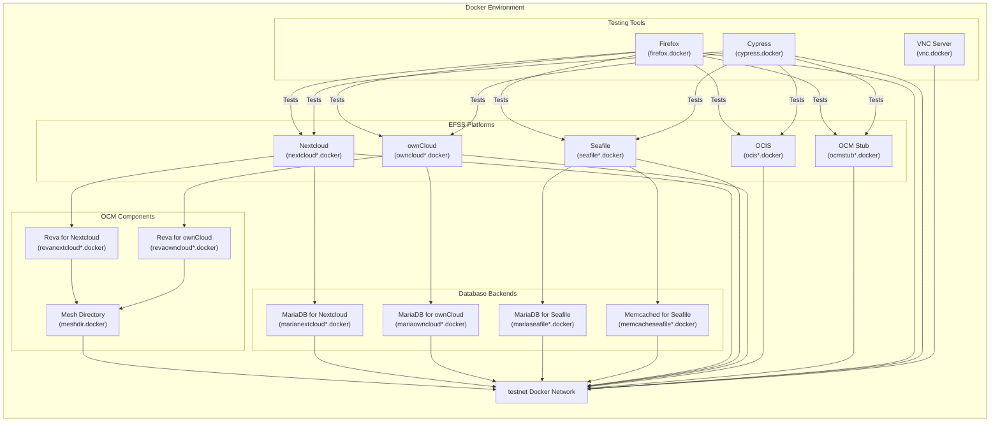
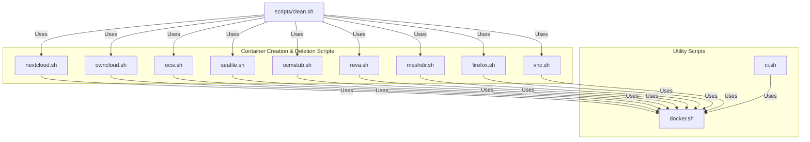

# Local Setup
This guide provides instructions for setting up a local development environment for the OCM test suite in the dev-stock repository. This environment consists of Docker containers for various Enterprise File Synchronization and Sharing (EFSS) platforms (Nextcloud, ownCloud, OCIS, Seafile, OCM Stub) and testing tools for evaluating federated sharing functionality.


## Prerequisites
- Docker Engine
- Git
- Bash shell
- Sufficient disk space for Docker images (several GB)
- Port availability (4501-4506, 5700, 5800, 9003)

## Architecture Overview
The local development environment consists of multiple Docker containers networked together:



## Container Management Scripts
The repository includes several scripts for managing the development environment:



## Setup Options
### Option 1: Gitpod (Cloud Development Environment)
The repository is configured for Gitpod, which provides a pre-configured development environment:

1. Open the repository in Gitpod
2. Gitpod will execute the prebuild script to initialize the environment.


### Option 2: Local Setup
For local setup, follow these steps:

1. Clone the repository:
    ```sh
    git clone https://github.com/pondersource/dev-stock.git
    cd dev-stock
    ```
2. Run the prebuild script to pull all required Docker images:
    ```sh
    ./init/prebuild.sh
    ```
3. Clean and initialize the Docker environment:
    ```sh
    ./scripts/clean.sh
    ```
The `clean.sh` script performs several important functions:

- Stops and removes Docker containers
- Prunes Docker volumes and system resources
- Recreates the "testnet" Docker network

## Managing Containers
### Creating EFSS Platform Containers
The repository includes scripts for creating different EFSS platform containers:

#### Nextcloud
```sh
# Function signature: create_nextcloud(number, user, password, image, tag, [extra_env], [is_ci_image])
# Example:
create_nextcloud 1 "admin" "password" "pondersource/nextcloud" "v27.0.0"
```

#### ownCloud
```sh
# Function signature: create_owncloud(number, user, password, image, tag)
# Example:
create_owncloud 1 "admin" "password" "pondersource/owncloud" "v10.13.0"
```

#### Seafile
```sh
# Function signature: create_seafile(number, user, password, image, tag, remote_ocm_server)
# Example:
create_seafile 1 "admin@example.com" "password" "pondersource/seafile" "v10.0.1" "nextcloud1.docker"
```

#### OCIS
```sh
# Function signature: create_ocis(number, image, tag)
# Example:
create_ocis 1 "pondersource/ocis" "v5.0.0"
```

#### OCM Stub
```sh
# Function signature: create_ocmstub(number, image, tag)
# Example:
create_ocmstub 1 "pondersource/ocmstub" "v1.0.0"
```

### Automated Test Environment Setup
Instead of creating containers manually, you can use the test scripts to set up a complete test environment. For example:

```sh
# Sets up Nextcloud and ownCloud containers with their databases and testing tools
./scripts/nextcloud-owncloud.sh v27.0.0 v10.13.0 dev electron
```

This creates:
- Nextcloud container with MariaDB
- ownCloud container with MariaDB
- Reva containers for OCM
- Mesh Directory
- Cypress, Firefox, and VNC for testing

### Cleaning Up
To clean up the Docker environment, use the `clean.sh` script:

```sh
./scripts/clean.sh
```

This script:
- Stops and removes Docker containers
- Prunes Docker volumes and system resources
- Recreates the "testnet" Docker network

### Selective Cleanup
You can also clean up specific containers by providing their names as arguments:

```sh
./scripts/clean.sh no cypress meshdir firefox vnc nextcloud1 owncloud1
```

The first argument (`no`) prevents the terminal from being cleared after cleanup.

## Port Configuration
The development environment uses several ports:

| Port(s)   | Service           | Description                                       |
|-----------|-------------------|---------------------------------------------------|
| 4501‑4506 | EFSS Platforms    | Various EFSS platform services                    |
| 5700      | VNC               | VNC server to view Cypress                        |
| 5800      | Firefox           | Embedded browser to access Docker containers      |
| 9003      | Xdebug            | Xdebug client port                                |

## Debugging and Development
### Xdebug Support
Xdebug is configured for PHP debugging in the Nextcloud and ownCloud containers:

```php
zend_extension=xdebug.so
xdebug.mode="develop,debug,coverage"
xdebug.start_with_request = yes
xdebug.client_host = "host.docker.internal"
xdebug.client_port = "9003"
xdebug.idekey="VSCODE"
xdebug.log=/var/www/html/xdebug.log
xdebug.log_level = 0
```

### Visual Testing with VNC
For visual testing, the environment includes a VNC server:

- VNC server available at (gives you the view of cypress): `http://localhost:5700`
- Firefox browser available at: `http://localhost:5800`

This allows you to watch tests run in real-time.

## Common Issues and Troubleshooting
### Container Creation Failures

If container creation fails, check:

- Docker daemon is running
- Sufficient system resources (memory, disk space)
- Port conflicts (check with docker ps or netstat -tuln)

### Network Issues
If containers can't communicate, ensure the "testnet" Docker network exists:

```sh
docker network inspect testnet
```

If it doesn't exist, it can be created with:

```sh
docker network create testnet
```

Or use the clean script's function:

```sh
./scripts/clean.sh
```

### Resource Limitations
The development environment can be resource-intensive (specilally in GitPod or Codespaces). If you experience performance issues:

- Stop unused containers to free resources
- Increase Docker's resource allocation in Docker Desktop settings
- Use selective container creation instead of starting all containers
- **Last Resort!** Use this commands to remove every image and system caches.
    ```sh
    docker volume prune -fa
    docker system prune -fa
    ```
### Docker Permission Issues
If you encounter (a very rare) permission issues with Docker:

```sh
# Add current user to docker group (Linux)
sudo usermod -aG docker $USER
# Then log out and log back in
```

### Handling Failed Test Runs
If tests fail or containers become corrupted:

```sh
# Clean everything and start fresh
./scripts/clean.sh
```

This will remove all containers, prune volumes, and recreate the network.

### Compatibility with macOS
To run the test suite locally on macOS you need `bash` version >4.x and `gnu-sed`. A more recent version of bash is needed to fix a problem with associative arrays in shell scripts. Likewise on macOS the options for `sed` behave differently. To ensure correct execution of the shell scripts, `gnu-sed` can be used.

Both `bash` and `gnu-sed` are installable with `brew`. Additionally `gnu-sed` should be added to the PATH environment by adding it to `~/.zshrc`. The installed dir for the replacement `sed` executable is usually `/opt/homebrew/opt/gnu-sed/libexec/gnubin`.
