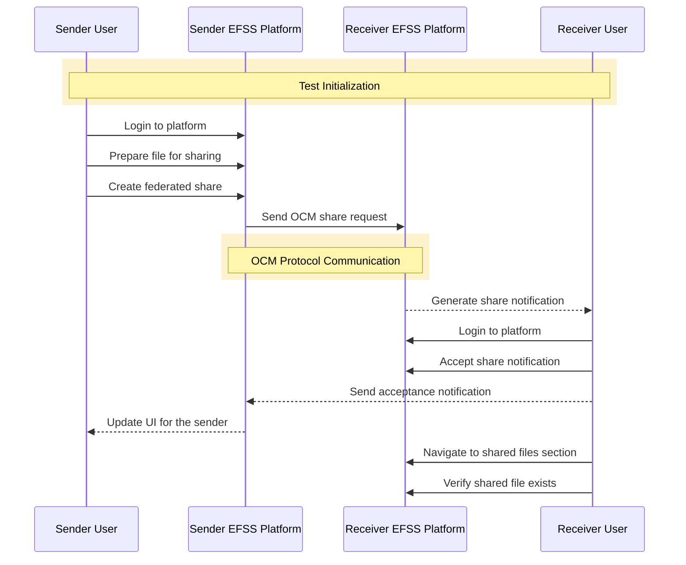
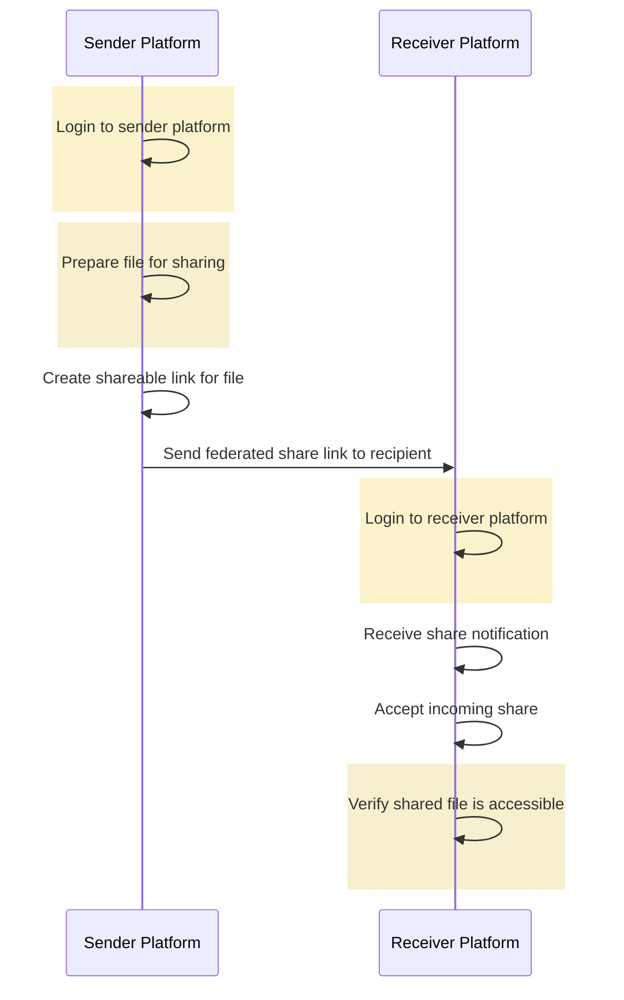
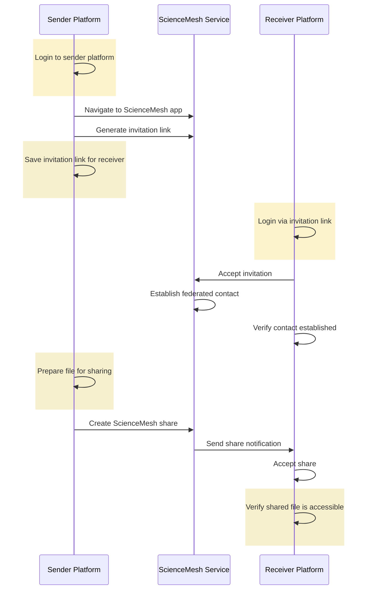
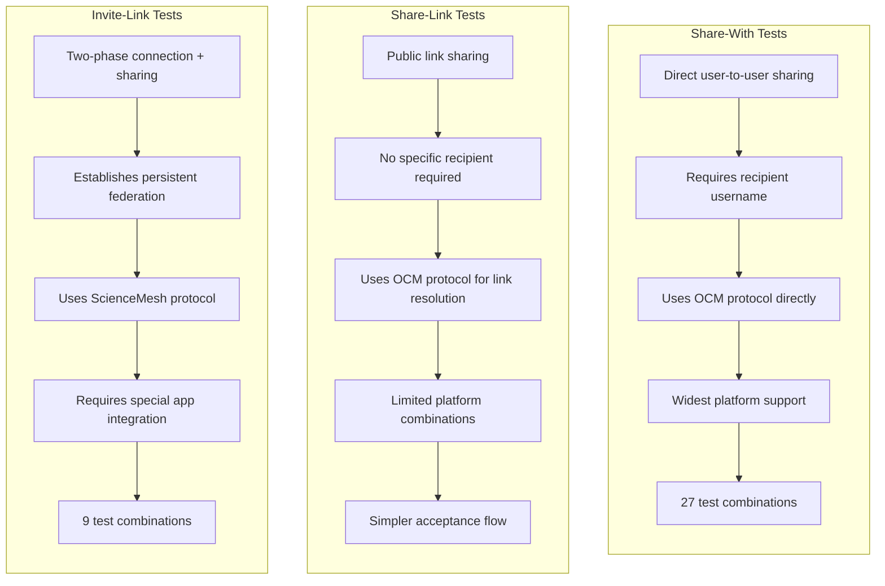
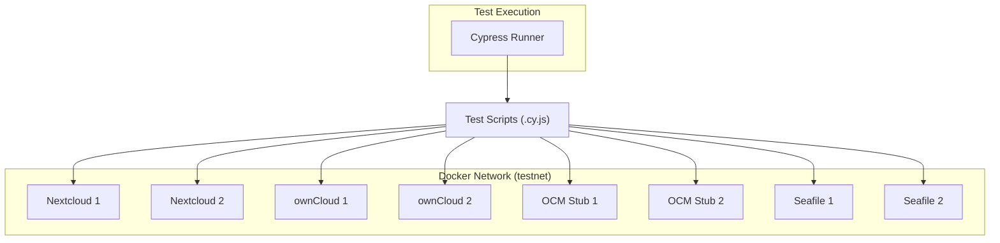

# Test Categories

The OCM Test Suite tests various federated sharing operations across different EFSS platforms. The test categories focus on different aspects of federated sharing:

## Share-With Tests
Share-With Tests verify the ability to directly share files with users on remote EFSS (Enterprise File Synchronization and Sharing) platforms using the OCM protocol. These tests validate federated sharing functionality between different platforms.

### Diagram: Share-With Test Flow


### Share-With Test Implementation Details
The Share-With tests follow a consistent pattern across different platform combinations:

1. **Sender Side**:
    - Login to the sender platform
    - Prepare a file (usually by renaming an existing file)
    - Create a federated share with a user on a remote platform
2. **Recipient Side**:
    - Login to the recipient platform
    - Accept the share notification
    - Verify the shared file exists and is accessible

Let's examine specific examples of Share-With tests:

**Example 1: OCMStub to ownCloud**
The OCMStub to ownCloud test demonstrates sharing from a lightweight OCM implementation to a full ownCloud instance: 

```js
it('Send a federated share of a file from OcmStub v1 to ownCloud v10', () => {
    // Step 1: Navigate to the federated share link on OcmStub 1.0
    // Remove trailing slash and leading https or http from recipientUrl
    cy.visit(`${senderUrl}/shareWith?${recipientUsername}@${recipientUrl.replace(/^https?:\/\/|\/$/g, '')}`);

    // Step 2: Verify the confirmation message is displayed
    cy.contains(expectedMessage, { timeout: 10000 })
      .should('be.visible')
  });
```

On the recipient side:

```js
it('Receive federated share of a file from OcmStub v1 to ownCloud v10', () => {
    // Step 1: Log in to the recipient's ownCloud instance
    cy.loginOwncloud(recipientUrl, recipientUsername, recipientPassword);

    // Step 2: Wait for the share dialog to appear and accept the incoming federated share
    acceptShare();

    // Step 3: Navigate to the correct section
    selectAppFromLeftSide('files');

    // Step 4: Verify that the shared file is visible
    ensureFileExists(sharedFileName);
});
```

**Example 2: Nextcloud to ownCloud**
The Nextcloud to ownCloud test verifies cross-platform sharing between two major EFSS platforms:

```js
it('Send a federated share of a file from Nextcloud v28 to ownCloud v10', () => {
    // Step 1: Log in to the sender's Nextcloud instance
    cy.loginNextcloud(senderUrl, senderUsername, senderPassword);

    // Step 2: Ensure the original file exists before renaming
    ensureFileExistsV28(originalFileName);

    // Step 3: Rename the file to prepare it for sharing
    renameFileV28(originalFileName, sharedFileName);

    // Step 4: Verify the file has been renamed
    ensureFileExistsV28(sharedFileName);

    // Step 5: Create a federated share for the recipient
    createShareV28(sharedFileName, recipientUsername, recipientUrl.replace(/^https?:\/\/|\/$/g, ''));
});
```

On the recipient side:

```js
it('Receive federated share of a file from Nextcloud v27 to ownCloud v10', () => {
    // Step 1: Log in to the recipient's ownCloud instance
    cy.loginOwncloud(recipientUrl, recipientUsername, recipientPassword);

    // Step 2: Wait for the share dialog to appear and accept the incoming federated share
    acceptShare();

    // Step 3: Navigate to the correct section
    selectAppFromLeftSide('files');

    // Step 4: Verify that the shared file is visible
    ensureFileExists(sharedFileName);
});
```

**Example 3: Seafile to Seafile**
The Seafile to Seafile test demonstrates federated sharing within the same platform type:

```js
/**
 * Test Case: Sending a federated share from Seafile 1 to Seafile 2.
 */
it('should successfully send a federated share of a file from Seafile 1 to Seafile 2', () => {
    // Step 1: Log in to Seafile 1
    cy.loginSeafile(senderUrl, senderUsername, senderPassword);

    // Step 2: Dismiss any modals if present
    dismissModalIfPresentV11();

    // Step 3: Open share dialog for the first file
    openShareDialog();

    // Step 4: Open federated sharing tab
    openFederatedSharingTab();

    // Step 5: Select the remote Seafile server
    selectRemoteServer('seafile2');

    // Step 6: Share with remote user
    shareWithRemoteUser(recipientUsername);
});
```

On the recipient side:

```js
/**
 * Test Case: Receiving a federated share on Seafile 2.
 */
it('should successfully receive and display a federated share of a file on Seafile 2', () => {
    // Step 1: Log in to Seafile 2
    cy.loginSeafile(recipientUrl, recipientUsername, recipientPassword);

    // Step 2: Dismiss any modals if present
    dismissModalIfPresentV11();

    // Step 3: Navigate to received shares section
    navigateToReceivedShares();

    // Step 4: Verify the received share is visible
    verifyReceivedShare(senderUsername, senderUrl);
});
```

## Share-Link Tests
Share-Link tests verify the federated sharing functionality where a user on one EFSS platform (Enterprise File Synchronization and Sharing) can create a public share link and send it to a user on another EFSS platform.

### Test Flow
Share-Link tests follow this general workflow: 

```js
describe('Share Link Federated Sharing Functionality for Nextcloud', () => {
  // Shared variables to avoid repetition and improve maintainability
  const senderUrl = Cypress.env('NEXTCLOUD1_URL') || 'https://nextcloud1.docker';
  const recipientUrl = Cypress.env('NEXTCLOUD2_URL') || 'https://nextcloud2.docker';
  const senderUsername = Cypress.env('NEXTCLOUD1_USERNAME') || 'einstein';
  const senderPassword = Cypress.env('NEXTCLOUD1_PASSWORD') || 'relativity';
  const recipientUsername = Cypress.env('NEXTCLOUD2_USERNAME') || 'michiel';
  const recipientPassword = Cypress.env('NEXTCLOUD2_PASSWORD') || 'dejong';
  const originalFileName = 'welcome.txt';
  const sharedFileName = 'share-link-nc1-to-nc2.txt';

  /**
   * Test Case: Sending a federated share link from one Nextcloud instance to another.
   * Validates that a file can be successfully shared via link from Nextcloud Instance 1 to Nextcloud Instance 2.
   */
  it('Send federated share link of a file from Nextcloud v27 to Nextcloud v27', () => {
    // Step 1: Log in to the sender's Nextcloud instance
    cy.loginNextcloud(senderUrl, senderUsername, senderPassword);

    // Step 2: Ensure the original file exists before renaming
    ensureFileExistsV27(originalFileName);

    // Step 3: Rename the file to prepare it for sharing
    renameFileV27(originalFileName, sharedFileName);

    // Step 4: Verify the file has been renamed
    ensureFileExistsV27(sharedFileName);

    // Step 5: Create and send the share link to the recipient
    createAndSendShareLinkV27(
      sharedFileName,
      recipientUsername,
      recipientUrl.replace(/^https?:\/\/|\/$/g, '')
    );
  });

  /**
   * Test Case: Receiving and accepting a federated share link on the recipient's Nextcloud instance.
   * Validates that the recipient can successfully accept the share link and view the shared file.
   */
  it('Receive federated share link of a file from Nextcloud v27 to Nextcloud v27', () => {
    // Step 1: Log in to the recipient's Nextcloud instance
    cy.loginNextcloud(recipientUrl, recipientUsername, recipientPassword);

    // Step 2: Wait for the share dialog to appear and accept the incoming federated share
    acceptShareV27();

    // Step 3: Navigate to the shareoverview section
    navigationSwitchLeftSideV27('Open navigation');
    selectAppFromLeftSideV27('files');
    navigationSwitchLeftSideV27('Close navigation');

    // Step 4: Verify the shared file is visible
    ensureFileExistsV27(sharedFileName);
  });
});
```

1. A file is prepared on the sender's platform
2. The sender creates a share link for the file
3. The sender sends the link to the recipient via OCM federation
4. The recipient receives a notification about the incoming share
5. The recipient accepts the share
6. The recipient verifies they can access the shared file

### Implementation Details
The implementation uses Cypress for test automation and consists of two main test cases: 

```js
describe('Share Link Federated Sharing Functionality for Nextcloud', () => {
  // Shared variables to avoid repetition and improve maintainability
  const senderUrl = Cypress.env('NEXTCLOUD1_URL') || 'https://nextcloud1.docker';
  const recipientUrl = Cypress.env('NEXTCLOUD2_URL') || 'https://nextcloud2.docker';
  const senderUsername = Cypress.env('NEXTCLOUD1_USERNAME') || 'einstein';
  const senderPassword = Cypress.env('NEXTCLOUD1_PASSWORD') || 'relativity';
  const recipientUsername = Cypress.env('NEXTCLOUD2_USERNAME') || 'michiel';
  const recipientPassword = Cypress.env('NEXTCLOUD2_PASSWORD') || 'dejong';
  const originalFileName = 'welcome.txt';
  const sharedFileName = 'share-link-nc1-to-nc2.txt';

  /**
   * Test Case: Sending a federated share link from one Nextcloud instance to another.
   * Validates that a file can be successfully shared via link from Nextcloud Instance 1 to Nextcloud Instance 2.
   */
  it('Send federated share link of a file from Nextcloud v27 to Nextcloud v27', () => {
    // Step 1: Log in to the sender's Nextcloud instance
    cy.loginNextcloud(senderUrl, senderUsername, senderPassword);

    // Step 2: Ensure the original file exists before renaming
    ensureFileExistsV27(originalFileName);

    // Step 3: Rename the file to prepare it for sharing
    renameFileV27(originalFileName, sharedFileName);

    // Step 4: Verify the file has been renamed
    ensureFileExistsV27(sharedFileName);

    // Step 5: Create and send the share link to the recipient
    createAndSendShareLinkV27(
      sharedFileName,
      recipientUsername,
      recipientUrl.replace(/^https?:\/\/|\/$/g, '')
    );
  });

  /**
   * Test Case: Receiving and accepting a federated share link on the recipient's Nextcloud instance.
   * Validates that the recipient can successfully accept the share link and view the shared file.
   */
  it('Receive federated share link of a file from Nextcloud v27 to Nextcloud v27', () => {
    // Step 1: Log in to the recipient's Nextcloud instance
    cy.loginNextcloud(recipientUrl, recipientUsername, recipientPassword);

    // Step 2: Wait for the share dialog to appear and accept the incoming federated share
    acceptShareV27();

    // Step 3: Navigate to the shareoverview section
    navigationSwitchLeftSideV27('Open navigation');
    selectAppFromLeftSideV27('files');
    navigationSwitchLeftSideV27('Close navigation');

    // Step 4: Verify the shared file is visible
    ensureFileExistsV27(sharedFileName);
  });
});
```

The `createAndSendShareLinkV27` utility function manages the sharing process:
```js
export function createAndSendShareLinkV27(fileName, recipientUsername, recipientDomain) {
  return createShareLinkV27(fileName).then((shareLink) => {
    cy.visit(shareLink);

    // Open the header actions menu and click save external share
    cy.get('button[id="header-actions-toggle"]').click();
    cy.get('button[id="save-external-share"]').click();

    // Fill in the recipient's address and save
    cy.get('form[class="save-form"]').within(() => {
      cy.get('input[id="remote_address"]').type(`${recipientUsername}@${recipientDomain}`);
      cy.get('input[id="save-button-confirm"]').click();
    });
  });
}
```

### Diagram: Share-Link Test Flow



## Invite-Link Tests
Invite-Link tests verify a different federation mechanism that uses ScienceMesh for establishing federated contacts between users on different EFSS platforms and subsequently sharing files.

### Test Flow
Invite-Link tests follow this general workflow:
```js
describe('Invite link federated sharing via ScienceMesh functionality between ownCloud and Nextcloud', () => {
  // Shared variables to avoid repetition and improve maintainability
  const senderUrl = Cypress.env('OWNCLOUD1_URL') || 'https://owncloud1.docker';
  const recipientUrl = Cypress.env('NEXTCLOUD1_URL') || 'https://nextcloud1.docker';
  const senderUsername = Cypress.env('OWNCLOUD1_USERNAME') || 'marie';
  const senderPassword = Cypress.env('OWNCLOUD1_PASSWORD') || 'radioactivity';
  const recipientUsername = Cypress.env('NEXTCLOUD1_USERNAME') || 'einstein';
  const recipientPassword = Cypress.env('NEXTCLOUD1_PASSWORD') || 'relativity';
});
```

```js
/**
   * Test case: Sending an invitation link from ownCloud to Nextcloud.
   * Steps:
   * 1. Log in to the sender's ownCloud instance
   * 2. Navigate to the ScienceMesh app
   * 3. Generate the invite link and save it to a file
   */
  it('Send invitation from ownCloud v10 to Nextcloud v27', () => {
    // Step 1: Log in to the sender's ownCloud instance
    cy.loginOwncloud(senderUrl, senderUsername, senderPassword);

    // Step 2: Navigate to the ScienceMesh app
    cy.visit(`${senderUrl}/index.php/apps/sciencemesh/`);

    // Step 3: Generate an invite link and save it to a file
    createInviteLink(recipientUrl).then((inviteLink) => {
      // Step 4: Ensure the invite link is not empty
      expect(inviteLink).to.be.a('string').and.not.be.empty;
      // Step 5: Save the invite link to a file for later use
      cy.writeFile(inviteLinkFileName, inviteLink);
    });
});
```

1. The sender generates an invitation link through ScienceMesh
2. The sender saves the invitation link for the receiver
3. The receiver uses the invitation link to establish a federated contact
4. The receiver accepts the invitation
5. A federated contact relationship is established between sender and receiver
6. The sender shares a file with the receiver using the established federation
7. The receiver accepts the share and verifies they can access the file


### Implementation Details
The invite-link tests are more complex and involve multiple stages:

1. **Create Invitation**:
    ```js
    /**
     * Test case: Sending an invitation link from ownCloud to Nextcloud.
     * Steps:
     * 1. Log in to the sender's ownCloud instance
     * 2. Navigate to the ScienceMesh app
     * 3. Generate the invite link and save it to a file
     */
    it('Send invitation from ownCloud v10 to Nextcloud v27', () => {
        // Step 1: Log in to the sender's ownCloud instance
        cy.loginOwncloud(senderUrl, senderUsername, senderPassword);

        // Step 2: Navigate to the ScienceMesh app
        cy.visit(`${senderUrl}/index.php/apps/sciencemesh/`);

        // Step 3: Generate an invite link and save it to a file
        createInviteLink(recipientUrl).then((inviteLink) => {
        // Step 4: Ensure the invite link is not empty
        expect(inviteLink).to.be.a('string').and.not.be.empty;
        // Step 5: Save the invite link to a file for later use
        cy.writeFile(inviteLinkFileName, inviteLink);
        });
    });
    ```

2. **Accept Invitation**:
    ```js
    it('Accept invitation from ownCloud v10 to Nextcloud v27', () => {
        const expectedContactDisplayName = senderUsername;
        // Extract domain without protocol or trailing slash
        // Note: The 'reva' prefix is added to the expected contact domain as per application behavior
        const expectedContactDomain = `reva${senderDomain}`;

        // Step 1: Load the invite link from the saved file
        cy.readFile(inviteLinkFileName).then((inviteLink) => {
        // Step 2: Ensure the invite link is valid
        expect(inviteLink).to.be.a('string').and.not.be.empty;

        // Step 3: Login to the recipient's Nextcloud instance using the invite link
        cy.loginNextcloudCore(inviteLink, recipientUsername, recipientPassword);

        // Step 4: Accept the invitation
        acceptScienceMeshInvitation();

        // Step 5: Verify that the sender is now a contact in the recipient's contacts list
        verifyFederatedContactV27(
            recipientDomain,
            expectedContactDisplayName,
            expectedContactDomain
        );
        });
    });
    ```

3. **Share File via ScienceMesh**:
    ```js
    it('Send ScienceMesh share <file> from ownCloud v10 to Nextcloud v27', () => {
        // Step 1: Log in to the sender's ownCloud instance
        cy.loginOwncloud(senderUrl, senderUsername, senderPassword);

        // Step 2: Ensure the original file exists
        ensureFileExists(originalFileName);

        // Step 3: Rename the file
        renameFile(originalFileName, sharedFileName);

        // Step 4: Verify the file has been renamed
        ensureFileExists(sharedFileName);

        // Step 5: Create a federated share for the recipient via ScienceMesh
        // Note: The 'reva' prefix is added to the recipient domain as per application behavior
        createScienceMeshShare(
        sharedFileName,
        recipientUsername,
        `reva${recipientDomain}`,
        );
    });
    ```

4. **Receive and Verify Share**:
    ```js
    it('Receive ScienceMesh share <file> from ownCloud v10 to Nextcloud v27', () => {
        // Step 1: Log in to the recipient's Nextcloud instance
        cy.loginNextcloud(recipientUrl, recipientUsername, recipientPassword);

        // Step 2: Wait for the share dialog to appear and accept the incoming federated share
        acceptShareV27();

        // Step 3: Navigate to the correct section
        navigationSwitchLeftSideV27('Open navigation');
        selectAppFromLeftSideV27('files');
        navigationSwitchLeftSideV27('Close navigation');

        // Step 4: Verify the shared file is visible
        ensureFileExistsV27(sharedFileName);

        // TODO @MahdiBaghbani: Download or open the file to verify content (if required)
    });
    ```

The utility functions used include `createInviteLink` and `acceptScienceMeshInvitation`:
```js
export function createInviteLink(targetDomain) {
// Ensure the "Generate Token" button is visible and click it
cy.get('button#token-generator')
    .should('be.visible')
    .click();

// Extract the token and construct the invite link
return cy.get('input.generated-token-link')
    .invoke('val')
    .then((link) => {
    if (!link) {
        throw new Error('Invite link generation failed: No link found in the input field.');
    }
    // Extract the query parameters from the link
    const url = new URL(link);
    const queryParams = url.searchParams.toString();
    // Construct the invite link with the target domain
    return `${targetDomain}/index.php/apps/sciencemesh/accept?${queryParams}`;
    });
}
```

```js
export function acceptScienceMeshInvitation(timeout = 10000) {
// Wait for the accept button to be visible and enabled
cy.get('input#accept-button', { timeout })
    .should('be.visible')
    // Ensure the button is not disabled
    .and('not.be.disabled')
    .click();
}
```

### Diagram: Invite-Link Test Flow


## Test Suite Infrastructure and Execution
The OCM test suite is organized to support multiple EFSS platform combinations:

```sh
handle_share_link() {
    local platform1="${1}"
    local version1="${2}"
    local platform2="${3}"
    local version2="${4}"
    local mode="${5}"
    local browser="${6}"
    local script_path="${ENV_ROOT}/dev/ocm-test-suite/share-link/${platform1}-${platform2}.sh"

    # Check for unsupported combinations.
    if [[ "${platform1}-${platform2}" =~ ^(nextcloud-seafile|owncloud-seafile|seafile-nextcloud|seafile-owncloud)$ ]]; then
        print_error "Combination '${platform1}-${platform2}' is not supported for 'share-link' test case."
        exit 1
    else
        run_test_script "${script_path}" "${version1}" "${version2}" "${mode}" "${browser}"
    fi
}
```

```sh
handle_invite_link() {
    local platform1="${1}"
    local version1="${2}"
    local platform2="${3}"
    local version2="${4}"
    local mode="${5}"
    local browser="${6}"
    local script_path="${ENV_ROOT}/dev/ocm-test-suite/invite-link/${platform1}-${platform2}.sh"

    # Check for unsupported combinations.
    if [[ "${platform1}-${platform2}" =~ ^(nextcloud-seafile|owncloud-seafile|seafile-nextcloud|seafile-owncloud)$ ]]; then
        print_error "Combination '${platform1}-${platform2}' is not supported for 'invite-link' test case."
        exit 1
    else
        run_test_script "${script_path}" "${version1}" "${version2}" "${mode}" "${browser}"
    fi
}
```

The tests can be executed both in development mode and CI mode, an example from GitHub Actions workflow invoking the tests in ci mode:

```yaml
- name: Run tests.
shell: bash
run: ./dev/ocm-test-suite.sh share-link ${{ matrix.sender.platform }} ${{ matrix.sender.version }} ci electron ${{ matrix.receiver.platform }} ${{ matrix.receiver.version }}
```

## Comparison of Test Categories
Now that we've analyzed all three test categories (Share-With, Share-Link, and Invite-Link), let's compare their key characteristics:



## Platform-Specific Implementations
The OCM Test Suite uses platform-specific utility functions to handle the differences between EFSS platforms. For example, the acceptance of shares is implemented differently for each platform:

- For ownCloud v10:
    ```js
    acceptShare()
    ```

- For Nextcloud v27:
    ```js
    acceptShareV27()
    ```

- For Nextcloud v28:
    ```js
    handleShareAcceptanceV28(sharedFileName)
    ```

This abstraction allows the test cases to remain consistent while accommodating platform-specific behaviors.

> There is some inconsistency in the
function naming that I have to fix,
it's on my backlog and I didn't quite have to fix it yet, but surly I will do that soon. #TODO :-)

## Integration with Docker Environment
All test categories run in a Docker-based test environment that creates isolated instances of each EFSS platform. The OCM Test Suite Architecture wiki page describes this environment:



## Key Differences
1. **Share-With Tests**:
    - Direct user-to-user sharing
    - Requires knowing the recipient's username and server
    - Most widely supported across platforms
    - Tests the core OCM protocol functionality

2. **Share-Link Tests**:
    - Creates public links that can be accessed by anyone
    - No need to specify a recipient in advance
    - Simpler sharing workflow
    - Limited platform support (some combinations not supported)

3. **Invite-Link Tests**:
    - Two-phase process: establish connection, then share
    - Creates persistent federated relationships
    - Requires ScienceMesh integration
    - More complex workflow but enables ongoing collaboration

## Notes
- Share-With Tests form the largest category in the OCM Test Suite with 27 test combinations.
- The tests cover a wide range of platform combinations, including Nextcloud, ownCloud, OCMStub, and Seafile.
- Each test is split into two parts: sending the share and receiving/accepting the share.
- Platform-specific utility functions abstract away the differences between platforms, allowing for consistent test cases.
- Some platforms like Seafile have unique sharing interfaces that require specialized test implementations.
- The Share-Link tests are simpler and focus on the basic OCM federation capabilities for sharing files across platforms.
- The Invite-Link tests are more complex and specifically test the ScienceMesh federation mechanism which establishes federated contacts before sharing.
- Both test categories are crucial for validating the interoperability between different EFSS platforms in cloud federation scenarios.
- The OCM Test Suite Architecture provides a comprehensive framework for testing federated sharing across different EFSS platforms.

Wiki pages you might want to explore:
- OCM Test Suite Architecture
